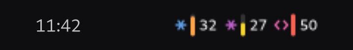

<div align="center">


# quartermaster

**Cuánta cuota te queda, en todas tus cuentas de agentes.**
Cada perfil de Claude Code y, si están instalados, Codex y los proveedores de opencode.

[Landing](https://quartermaster.legios.com.ar/) ·
[Instalar](#instalar) ·
[Releases](https://github.com/legiosai/quartermaster/releases) ·
MIT

<sub>Un instrumento de</sub><br>
<a href="https://github.com/legiosai"><picture>
  <source media="(prefers-color-scheme: dark)" srcset="docs/legios.svg">
  <source media="(prefers-color-scheme: light)" srcset="docs/legios-claro.svg">
  
</picture></a>



</div>


> **Misión.** Que nadie se entere de que se quedó sin cuota chocándose contra el
> límite.

Ver [`SOUL.md`](SOUL.md) para la métrica, los non-goals y la apuesta falsable.

## Instalar

```sh
brew install legiosai/tap/quartermaster        # macOS y Linux
npm install -g @legios/quartermaster           # cualquier lado
```

En Debian y Ubuntu, el `.deb` de la [última
release](https://github.com/legiosai/quartermaster/releases/latest):

```sh
sudo apt install ./quartermaster_0.1.3_all.deb
```

En **Windows**, el instalador de la [última
release](https://github.com/legiosai/quartermaster/releases/latest). Se instala
para el usuario y sin UAC: deja `qm` en el `PATH`, la bandeja en el menú Inicio
y, si dejás marcada la tarea, la bandeja arrancando sola. Lo arma
`scripts/hacer-setup.ps1`, junto con un zip portable.

Los manifests de **winget** y **scoop** están armados y todavía no aprobados —
un `winget install` publicado antes de que el paquete exista es el defecto de
H9 otra vez, así que acá no figura hasta que entre. Los pasos de cada catálogo
están en [`paquetes/README.md`](paquetes/README.md).

En **Arch** hay un `PKGBUILD` en `paquetes/aur/`, y con **Nix** anda sin
instalar nada:

```sh
nix run github:legiosai/quartermaster
```

O desde el repo, sin instalar nada global:

```sh
git clone https://github.com/legiosai/quartermaster && cd quartermaster
npm install && make instalar    # deja `qm` en ~/.local/bin
```

Necesita **Node >= 22.6**: `qm` lee el TypeScript sin paso de build, y eso
recién existe desde ahí. El lanzador lo busca en el `PATH` y en las versiones de
nvm; si no encuentra uno que sirva, lo dice y explica cómo conseguirlo. Por eso
el `.deb` depende de `nodejs` a secas y no de `nodejs (>= 22.6)`: Debian 13 trae
un 20, y pedir 22.6 haría un paquete que no se instala en ninguna parte por una
razón que además no es cierta —la versión nueva suele estar en nvm, que apt no
ve—. Mejor un paquete que instala y avisa.

El `.deb` se arma con `scripts/hacer-deb.sh`, que no compila nada: el paquete es
el fuente más un enlace en `/usr/bin`, y por eso es `Architecture: all`.

### ¿Se actualiza solo?

**Los archivos, cuando vos se lo pedís al gestor**; ninguno de los tres baja
versiones nuevas por su cuenta:

| | trae la versión nueva con | automático de fábrica |
|---|---|---|
| apt | `sudo apt update && sudo apt upgrade` | no — `unattended-upgrades` sólo toca los orígenes que le configures |
| Homebrew | `brew upgrade` | no — salvo que instales `brew autoupdate` |
| npm | `npm update -g @legios/quartermaster` | no |

**El indicador que ya está corriendo sí se actualiza solo.** Ése era el agujero
real: `apt upgrade` reemplaza los archivos y se va, pero el proceso que está
andando tiene el módulo cargado en memoria y sigue con el código viejo hasta que
alguien lo reinicie — y no lo reinicia nadie, porque el indicador es justo lo que
se deja andando y se olvida. Así que se vigila a sí mismo y se vuelve a lanzar
con `execv` en cuanto su archivo cambia.

Con una condición que no es opcional: **compila la versión nueva antes de
saltar**. Si está rota, se queda con la que anda y lo dice. Reiniciar a ciegas
dejaría al usuario sin indicador, que es peor que tenerlo desactualizado.

## El problema

Claude Code soporta varios perfiles vía `CLAUDE_CONFIG_DIR`, y cada perfil tiene
su propia cuenta y su propia credencial. Un asiento de trabajo y una
suscripción personal en la misma laptop es completamente normal.

Los monitores que existen leen **una** credencial: la del directorio por
defecto. En la máquina donde se escribió esto eso significa leer `~/.claude`,
que está vacío, mientras las dos cuentas reales viven en `~/.claude-personal`
(Max) y `~/.claude-teams` (Teramot). El resultado observado fue un monitor
polleando cada 120 segundos durante horas, escribiendo `credential expired —
gating poll` en su log, y mostrando nada.

## Primer hallazgo: dónde está la credencial

En macOS el servicio del llavero de un perfil es **determinista**:

| Directorio de configuración | Servicio del llavero |
|---|---|
| `~/.claude` (por defecto) | `Claude Code-credentials` |
| cualquier otro | `Claude Code-credentials-<sha256(ruta absoluta)[:8]>` |

Verificado contra items reales del llavero. Eso convierte el soporte
multi-perfil en un cálculo, no en una heurística.

## Estado

| Hito | Estado | Número comiteado |
|---|---|---|
| **H0** perfiles y preflight | ✅ mecanismo | `make demo-h0` — descubre perfiles y dice cuáles autentican, no sólo cuáles existen |
| **H1** consumo local real | ✅ **número** | [`numeros/h1.json`](numeros/h1.json) — 9 340 requests deduplicados, 2,8 G de tokens en 7 días, 946 ms |
| **H2** poll de cuota en vivo | ✅ **número** | [`numeros/h2-endpoint.md`](numeros/h2-endpoint.md) — ejecutado por fin: con 95 min de cache, la sesión estaba **11 puntos** abajo y las semanales 0-2 |
| **H3** `--watch` y `--json` | ✅ mecanismo | `make qm`, `qm --json`, `qm --watch`, `qm --umbral=N` |
| **H4** Linux y Windows verificados | 🟨 Linux ✅, Windows ✅ el CLI · ⏳ la credencial | [`numeros/h4-linux.md`](numeros/h4-linux.md) · [`h4-windows.md`](numeros/h4-windows.md) |
| **H8** Codex en la misma tabla | ✅ mecanismo | cuota del disco (rollouts) + refresco por app-server + consumo local; `src/adapters/codex.ts` |
| **H5** cuota sin red ni credencial | ✅ **número** | [`numeros/h5-cuota.md`](numeros/h5-cuota.md) · [`h5-cuota.json`](numeros/h5-cuota.json) |
| **H6** verlo sin ir a buscarlo | ✅ mecanismo | `make indicador` en GNOME · `make tray` en Windows · `make web` en el navegador · `qm --breve` en la statusline de Claude Code |
| **H7** que te avise antes de chocar | ✅ mecanismo | proyección por mínimos cuadrados + avisos al 80/95 % y al detectar choque |
| **H9** el paquete de npm se instala y corre | ✅ **número** | [`numeros/h9-npm.json`](numeros/h9-npm.json) — instalado en un prefix limpio y ejecutado; `make gate-npm-rojo` muestra el rojo |

**Advertencias, para que el README no mienta:**

- **El cache se equivoca en la sesión, no en las semanales.** Medido en
  [`numeros/h2-endpoint.md`](numeros/h2-endpoint.md): con 95 minutos de cache,
  las semanales estaban 0-2 puntos abajo y la **sesión 10 y 11**. La ventana de
  5 h se llena veinte veces más rápido que la de 7 días, así que la misma vejez
  duele veinte veces más. Para la pregunta urgente —«¿puedo seguir ahora?»— el
  disco solo no alcanza: hay que refrescar.
- **Las ramas de error del endpoint siguen sin ejecutarse.** Contestó bien en
  todos los perfiles; token vencido a mitad de camino y endpoint caído siguen
  sin probarse.
- **`dur()` era distinta en Python que en las otras dos.** Le faltaba la rama de
  días, así que el panel de GNOME decía `3067h28m` donde el de Windows decía
  `127d19h`. Se vio poniendo los dos paneles al lado; no se ve mirando uno solo.
- **El número del cache puede estar viejo.** Claude Code lo refresca cuando
  quiere —medido: reescribió `.claude.json` 19 s antes y el bloque de cuota
  seguía siendo de hacía 83 minutos—. `qm` imprime la edad siempre.
- **En Windows nativo el CLI anda; la credencial sigue sin verificarse.**
  Medido y comiteado en [`numeros/h4-windows.md`](numeros/h4-windows.md): con
  Node nativo, `qm` contesta `plataforma: win32`, descubre los perfiles en rutas
  de Windows y lee la cuota de Codex del disco sin red ni credencial. Lo que
  sigue abierto es si Claude Code guarda la suya en `.credentials.json` o en
  DPAPI, y **no se pudo contestar porque en esa máquina Claude Code nunca corrió
  nativo**: no está en el PATH, no hay `.claude.json`, y el Credential Manager
  no tiene ninguna entrada de Anthropic. El adaptador sigue diciendo «sin
  verificar» en vez de inventar un diagnóstico.
- **macOS va a abrir un prompt del llavero por perfil** si se usa `--refrescar`.
  El camino por defecto ya no toca el llavero.

## Segundo hallazgo: la cuota ya está en el disco

Claude Code guarda en el `.claude.json` de cada perfil la última respuesta de
cuota que recibió, bajo `cachedUsageUtilization`. El número de cuota **es un
dato de disco**: no hace falta red, y sobre todo **no hace falta credencial**,
así que se lee igual en un perfil con el token vencido — que es exactamente el
estado en el que la herramienta que motivó este repo se quedaba muda.

Y trae un segundo silencio, este adentro de un mismo perfil. La respuesta
incluye un array `limits[]` con barras que **no** tienen clave propia arriba:

| Barra | % | Severidad | ¿activa? | Alcance |
|---|---:|---|---|---|
| `session` (= `five_hour`) | 8 | normal | no | — |
| `weekly_all` (= `seven_day`) | 59 | normal | no | — |
| **`weekly_scoped`** | **75** | **warning** | **sí** | modelo Fable |

`seven_day_opus`, `seven_day_sonnet` y otras diez venían `null`. Un monitor que
lea `five_hour` y `seven_day` —las dos que documenta la statusline— informa
**8 %**, se ve cómodo, y esconde la única barra con aviso. En esa cuenta el
error es de 67 puntos. Detalle y medición en
[`numeros/h5-cuota.md`](numeros/h5-cuota.md).

## La misma falla en Linux, y peor

`numeros/h4-linux.md` es la primera corrida fuera de macOS. Encontró 4 perfiles,
y con ellos una versión del problema original más difícil de notar: acá el
directorio por defecto **no** está vacío. Tiene 1,2 G de tokens y se ve
perfectamente sano.

> Un monitor que sólo lee `~/.claude` en esa máquina muestra un número
> creíble que deja afuera el **58,2 %** de los tokens y el **54 %** de los
> requests, todos del perfil de trabajo.

Un directorio vacío se nota. Un número que parece bien y está a la mitad, no.

## De dónde sale el endpoint de cuota

No está documentado. Se leyó del binario que Claude Code instala
(`node_modules/@anthropic-ai/claude-code/bin/claude.exe`), que contiene el call
site:

```
fetchUtilization: GET /api/oauth/usage (attempt
fetchUtilization: 200 after
```

La **forma** de la respuesta ya no se adivina: `cachedUsageUtilization` guarda
esa misma respuesta, y de ahí salieron las fixtures de `test/fixtures/`. Eso
confirmó lo que este README sospechaba antes de tener con qué probarlo: la
documentación de statusline embebida en el binario describe lo que Claude Code
**republica** (`used_percentage`, epoch en segundos), no lo que **recibe**
(`utilization`, ISO con offset). Un parser escrito sólo contra esa doc habría
leído mal las fechas.

Corolario operativo: **el endpoint puede desaparecer sin aviso**, y por eso ni
las transcripciones ni el cache son un fallback opcional (ver `SOUL.md`).

## La otra cuenta: Codex

Un asiento de trabajo, una suscripción personal y **una cuenta de Codex** en la
misma laptop es tan normal como lo anterior, y la pregunta es la misma: ¿me
queda cuota? Desde `src/adapters/codex.ts`, `qm` la contesta para las dos
herramientas en la misma tabla.

```
codex              vos@ejemplo.com                · plus
                   credencial: la pone codex · 2 reset(s) sin usar
                   cache · hace 1m
                 ▸ session                  ███████████████ 100% warning reinicia en 27m
                   weekly_all               ██████████░░░░░  67% reinicia en 139h04m
                   local: 13,0M en 7d · 5,3M en 5h · 443 requests
```

### Con qué está autenticado manda sobre lo que dejó escrito

Reportado a mano: la bandeja decía **`plus`** en una máquina sin ninguna
suscripción. La causa estaba entera en el disco:

- ocho rollouts en `~/.codex/sessions` con `"plan_type": "plus"` y barras de
  hasta el **94 %**, todos de **mayo de 2026**;
- un `~/.codex/auth.json` que dice `"auth_mode": "apikey"` y no tiene `tokens`
  ni `id_token`, sólo una `OPENAI_API_KEY`.

O sea: la suscripción existió, se dio de baja, y los rollouts de cuando existía
no se borran nunca. `codexEnDisco()` buscaba el rollout más nuevo **que tuviera
barras** y encontraba el del 5 de mayo, así que reportaba un plan que ya no está
y un porcentaje de hace **127 días** como si fuera de ahora. Peor: en una cuenta
que paga por uso y por lo tanto **no tiene barras**, mostraba barras.

`auth_mode` es la señal autoritativa y ahora se mira **antes** que los rollouts.
Con `apikey` la fila dice `sin-suscripcion` —«la cuenta no tiene límites de
suscripción que reportar (API key o enterprise)»— y el plan pasa a ser
`api key`. Es el mismo caso que las filas de opencode: un plan por API key cuyo
porcentaje sólo existe del otro lado. Y de paso deja de levantarse un
`app-server` con 20 s de timeout para preguntar algo que no puede contestar.

La regla está clavada en `test/codex.test.ts`, incluidos los dos bordes que
importan: un `auth.json` viejo sin `auth_mode` se deduce de qué guardó, y si
están la key **y** el `id_token` —Codex deja la key vieja cuando entrás con la
cuenta— gana el `id_token`, porque al revés una cuenta con suscripción de verdad
quedaría reportada como si no la tuviera.

### Una corrección

La primera versión de este README decía, en negrita, que **Codex no deja la
cuota en el disco**. Era falso. Se habían mirado tres rollouts de junio, que
traían `rate_limits: null`, y se generalizó a partir de ahí — el mismo error de
método que el repo le critica a los monitores que leen una sola credencial.

Los rollouts nuevos (codex-cli 0.153.4) **sí la traen**, adentro de los eventos
`token_count`, con el timestamp al lado. Así que Codex no es la excepción a H5:
es otro caso de H5. **El camino por defecto es el disco**, sin red y sin
credencial, y el app-server queda como refresco — lo que `--refrescar` es para
Claude. Medido: 212 ms para encontrar la lectura más nueva entre 138 rollouts.

Dos trampas que costaron un rato y que están cubiertas por tests:

- **Codex escribe varios baldes de límites.** Después del bueno
  (`limit_id: "codex"`) manda uno de `limit_id: "premium"` con `primary: null`.
  Quedarse con el último devolvía ese, y descartarlo descartaba el archivo
  entero — con el número bueno adentro, unos milisegundos antes.
- **Las dos puntas escriben distinto.** El rollout usa `snake_case`
  (`used_percent`, `rate_limit_reached_type`) y el app-server `camelCase`. Se
  normaliza en un solo lugar, y hay un test que exige que las dos den
  exactamente lo mismo: si divergen, el número cambia según de dónde salió, que
  es peor que no tener número. Ese test encontró que `rate_limit_reached_type`
  no se leía del disco, así que «ya te frenó» no marcaba nada.

### Y el piso, que también estaba

Los mismos rollouts tienen `total_token_usage`, así que Codex tiene el consumo
local que pide `SOUL.md`: aunque el app-server se caiga **y** el disco no traiga
barras, sigue habiendo un número. Se suma el último acumulado de cada sesión, no
los parciales, para no contar dos veces.

Tres decisiones más:

- **No tocamos su credencial.** Al app-server se le habla por el binario
  `codex`, que usa la suya. El mail y el plan salen de los claims del `id_token`
  que Codex ya guardó — se leen, no se copian.
- **Los nombres de las ventanas se igualan por duración.** El servidor manda
  `primary` y `secondary`, que no dicen nada; 300 minutos es la misma pregunta
  que la `session` de Claude, y 10 080 es la semanal. Igualarlos es lo que deja
  comparar las dos cuentas en la misma columna.
- **`codex` no se busca en el PATH y ya.** launchd arranca con
  `PATH=/usr/bin:/bin:/usr/sbin:/sbin`; hay un `rutaCodex()` que mira también
  los lugares de siempre, y `QM_CODEX` para forzarlo.

## Elegir qué se muestra

Descubrir todo es la misión; **mostrar** todo es una preferencia. Con cuatro
cuentas la barra de menú ya no entra, y una cuenta que no usás es ruido
permanente.

```bash
qm --solo=codex,personal     # sólo esas
qm --ocultar=teams           # todas menos esa
```

o fijo, en `~/.config/quartermaster/config.json`:

```json
{ "ocultar": ["main"] }
```

Se acepta el nombre corto (`main`, `personal`, `teams`, `codex`) o el completo
del perfil. `mostrar` gana sobre `ocultar`. Como todos los que dibujan leen el
JSON de `qm`, la selección vale igual en la terminal, en la barra y en el
tablero, sin configurar nada tres veces.

Un detalle que es una regla del repo: **si el filtro no coincide con ninguna
cuenta, se muestran todas** y se dice que el filtro no pegó. Casi siempre es un
nombre mal escrito, y quedarse con una pantalla vacía y sin explicación es
exactamente el bug que motivó todo esto.

## Sumar otra herramienta: Gemini, GLM, MiniMax

La pregunta no es «¿se puede?» sino **de dónde sale el número**. Un proveedor
tiene que contestar tres cosas, y sólo la primera es obligatoria:

| | Qué es | Si falta |
|---|---|---|
| **1. Qué cuentas hay** | descubrir directorios/credenciales | no hay fila |
| **2. Cuánta cuota queda** | barras con % y reinicio | hay fila y una frase que dice por qué no hay número |
| **3. Cuánto consumiste** | el piso local, de transcripciones | se informa `null`, nunca `0` |

Hoy hay dos formas resueltas, y las dos sirven de molde:

- **Claude Code** — la cuota está en `.claude.json` (H5) y el endpoint es el
  refresco (H2).
- **Codex** — la cuota está en los rollouts y el app-server es el refresco. El
  consumo sale de los mismos archivos.

### GLM y MiniMax: estaban adentro de opencode

No hacía falta un CLI propio de cada uno. Los dos planes viven en **opencode**,
y opencode deja en `~/.local/share/opencode/opencode.db` una tabla `session` con
`model`, `cost` y cinco columnas de tokens. O sea: **el piso está**, local, sin
red y sin credencial, igual que las transcripciones de Claude y los rollouts de
Codex.

```
minimax    MiniMax-M3    2,7M en 7d · 2 sesiones
glm        glm-5.3       837,3k en 7d · 1 sesión
openai     gpt-5.6-sol   549,3k en 7d · 4 sesiones
grok       —             0 en 7d · último uso hace 8d21h
kimi       —             0 en 7d · último uso hace 14d18h
```

El descubrimiento y el consumo son dos preguntas distintas: las cuentas se
listan por **último uso** (30 días) y no por lo que gastaron en la ventana. Si
sólo se listara lo segundo, una cuenta que usás cada tanto desaparecería de la
lista — y «no aparece» es exactamente lo que este repo existe para que no pase.
Grok aparece con 0 en la semana y la fecha real al lado.

Dos decisiones:

- **No se lee `auth.json` de opencode.** Los proveedores se descubren de la base
  de sesiones, que además dice cuáles se usaron de verdad y no cuáles están
  configurados. La única forma segura de no filtrar una clave es no leerla.
- **La cuota no se inventa.** Son planes por API key: el porcentaje sólo existe
  en el endpoint de cada proveedor y hace falta la clave para pedirlo. La fila
  trae consumo y una frase que dice por qué no hay barra — nunca un 0 % que
  parezca un dato. Es un estado nuevo y explícito, `sin-cuota-legible`, distinto
  de «no hay límites» y de «todavía no se escribió».

### Dos correcciones en la misma fila

La fila de un plan de opencode traía dos cosas mal, y las dos salieron de
mirarla en la pantalla, no de leer el código.

**El plan mostraba el modelo.** Donde las otras filas ponen `team_tier_1` o
`plus`, la de opencode ponía `glm-5.3`. Eso salía de `plan: c.modelo` — el id
del modelo más usado en la ventana. Un modelo no es un plan: no dice qué pagás,
y **cambia solo** cuando cambiás de modelo. Además ya estaba en el desglose por
modelo, que es su lugar, así que aparecía dos veces. Ahora ese campo lleva el
proveedor, y la columna significa lo mismo en todas las filas.

**Y el mapa de nombres no aplicaba nunca.** Las claves eran `zai-coding-plan`,
`minimax-coding-plan`, `kimi-for-coding`. El `providerID` que opencode guarda en
esta máquina es **`zai`** a secas. Verificado contra la base: los proveedores
reales son `zai`, `openai`, `amazon-bedrock`, `anthropic` y `opencode-go`. O sea
que el nombre lindo no se aplicaba y la fila se llamaba `zai` en vez de `glm`.
Ahora están las dos formas de cada uno, porque no hay motivo para creer que el
`providerID` sea estable entre instalaciones — y esa suposición es justo la que
falló acá.

Ojo con esto último si tenés scripts: la cuenta ahora se llama `glm`, así que un
`--solo=zai` o un `--ocultar=zai` hay que actualizarlo.

### Y una tercera: la fila no aparecía en ninguna pantalla

Reportado a mano también: «no aparece lo de opencode que tengo una key de
z.ai». Y era cierto — `filasOpencode()` arrancaba con
`if (!hayOpencode() || o.breve) return []`, y **todas las pantallas piden
`--breve`**: la barra de macOS, la bandeja de Windows, el panel de GNOME y la
statusline. La fila existía sólo si corrías `qm` a mano en una terminal. Una
cuenta que se usó ayer y no aparece es, literalmente, el bug de la primera
sección de este README, con otro vendor.

Lo que costaba se midió antes de decidir: de los ~460 ms de leer opencode,
**439 eran `limitesOpencode()`** —la consulta que busca los 429 hace
`json_extract` del blob de cada mensaje, 10 173 en esta máquina— y el consumo
apenas 1,4 ms. Así que se arregló la consulta en vez de esconder la fila:
acotada por fecha baja a **3 ms**, y no se pierde nada que se use, porque lo
único que produce una barra es un límite cuyo reinicio todavía no pasó y ningún
proveedor reinicia en más de un mes. Con eso opencode entero son ~25 ms, que sí
entran en el contrato de `--breve`.

### Se probó de verdad antes de rendirse

No alcanza con decir «no se puede». Se buscó el porcentaje por los cuatro
caminos que había, con los endpoints reales sacados del binario de opencode:

| Camino | Resultado |
|---|---|
| Cabeceras en la base de opencode | sólo las de OpenAI (`x-codex-*`), y sólo en respuestas con error |
| `GET /models` con la clave | Z.ai **200**, MiniMax **200** — sin una sola cabecera `x-ratelimit-*` |
| Una llamada real de 1 token | MiniMax **200**, sin cabeceras. xAI **403**: el token OAuth que guarda opencode está vencido |
| Un archivo suyo en el disco | no existe |

**Pero la llamada real encontró otra cosa.** Z.ai contestó `429` con esto:

```json
{"error":{"code":"1310","message":"Weekly/Monthly Limit Exhausted.
          Your limit will reset at 2026-09-11 18:35:24"}}
```

O sea que el porcentaje no existe, pero **los dos datos que se usan sí**:
¿me frenaron? y ¿cuándo me libero? Y no hace falta salir a la red para
tenerlos, porque **opencode guarda esas respuestas**: en su base hay límites
alcanzados por proveedor, con la fecha de reinicio adentro del texto —incluida
la ventana de 5 h de Grok—. Se leen del disco, gratis y sin credencial, igual
que todo lo demás.

Así que una cuenta de opencode que está frenada **sí muestra barra**: 100 %,
con su reinicio y su «libre en». Una que no lo está no afirma nada — dice
cuándo fue la última vez que la frenaron, porque un límite de la semana pasada
no dice nada de hoy.

Lo que encontré en esta máquina para la que falta:

- **Gemini CLI 0.59.0** — instalado, autenticado (`oauth-personal`). Pero en
  `~/.gemini` **no hay ningún número de cuota ni de uso**: hay credenciales,
  cuentas, `installation_id` y estado de UI, y nada más. Su límite además no es
  un porcentaje sino requests por día, así que ni siquiera encaja en la forma
  `VentanaCuota` sin decidir antes qué significa «80 %» ahí. Da para el punto 1
  hoy; el 2 necesita encontrarle una fuente, y el 3 un lugar donde cuente
  tokens, que tampoco aparece.
El molde está y la selección de arriba ya prevé que sobren cuentas: con siete,
`--ocultar` deja de ser un lujo.

## Instalación

```bash
npm install
make instalar        # enlaza bin/qm y bin/qm-web en ~/.local/bin
qm                   # ya anda desde cualquier lado
qm-web               # y el tablero también
```

`bin/qm` **busca solo un Node ≥ 22.6**: mira `$QM_NODE`, después el del `PATH`,
después las versiones de nvm de mayor a menor. Hace falta porque qm se lee
directo del TypeScript, y en una máquina donde `node` es un 20 —lo normal si el
sistema trae uno y las versiones nuevas viven en nvm, que sólo se carga en
shells interactivos— un shebang común falla con un error de sintaxis que no le
dice nada a nadie.

## Uso

```bash
qm                     # cuota y consumo de todos los perfiles.
                       # Sin red y sin credencial: la cuota sale del disco
qm --breve             # un renglón, en milisegundos. Para una statusline
qm --refrescar         # además pide el número al endpoint (token vigente)
qm --json              # para scripts
qm --watch 60          # se redibuja cada 60 s
qm --umbral=80         # código de salida 3 si alguna barra pasa el 80 %
qm --sin-codex         # no mirar la cuenta de Codex
qm --calentar-codex    # refresca sólo el cache de Codex, sin imprimir nada
qm-web                 # el tablero en el navegador, se redibuja cada 30 s

make demo-h0           # ¿qué perfiles hay y cuáles autentican?
make demo-h1           # consumo de los últimos 7 días, por perfil
make numero-h5         # regenera numeros/h5-cuota.json, ya redactado
```

Requiere **Node ≥ 22.6** (lee TypeScript directamente, no hay paso de build).

## ¿Vas a chocarte antes de que se reinicie?

Es la pregunta que ni el porcentaje ni el consumo contestan solos. «Vas 75 %»
no dice nada sin saber a qué velocidad subís.

qm guarda una serie de lecturas por barra y le ajusta una recta:

```
ritmo: 12.4 pts/h · 100 % en 1h58m — antes del reinicio
```

Lo que importa no es la recta, es **cuándo no se dibuja**. Con dos lecturas, o
con una ventana que recién arranca, cualquier extrapolación es un número
inventado con cara de dato. Entonces dice:

```
ritmo: todavía no sé el ritmo: hacen falta 3 lecturas y hay 1
```

«No sé si te vas a chocar» y «no te vas a chocar» son cosas distintas y se
muestran distinto. Dos guardas más: se descartan las lecturas de más de 2 h
—el ritmo de hace cuatro horas no predice el de ahora— y no se proyecta sobre
un movimiento menor a 2 puntos, porque el servidor manda enteros y subir uno
no se distingue de un redondeo.

La serie vive en `~/.cache/quartermaster/historial.jsonl` y se indexa por el
`medidoEn` de la cuota, no por el momento en que qm miró: leer diez veces el
mismo cache deja **una** muestra.

## ¿Y cuánto me puedo gastar hoy?

La proyección contesta «a este ritmo, cuándo choco». Es la pregunta del que ya
va rápido. La del que todavía no chocó y quiere no chocar es otra: **cuánto
puedo gastar por día para que la cuota llegue justa al reinicio, y cuánto de eso
me queda hoy.** Un 78 % con reinicio el sábado no dice si mañana hay que frenar;
repartirlo sí, y en la misma unidad que todo lo demás:

```
presupuesto: podés gastar 4.2 %/día · hoy te queda 1.8 % · weekly_scoped (Fable)
```

La cuenta es de dos renglones y está en `src/core/presupuesto.ts`:

```
porDia    = (100 − porcentaje) / días hasta el reinicio
quedaHoy  = porDia × (horas que le quedan al día / 24)
```

Mira **hacia adelante**, y eso es lo que la hace honesta sin historial: todo lo
que ya gastaste hoy está adentro del porcentaje actual, así que no hay que
restarlo ni ir a buscarlo a un JSONL que puede no cubrir la medianoche. Si te
pasaste de rosca a la mañana, `porDia` baja solo en la lectura siguiente y
`quedaHoy` con él; si no tocaste nada, sube. Nunca da negativo.

Dos decisiones que no son obvias:

- **Se reparte la ventana larga, no la que frena.** Una de 5 h se reinicia
  cuatro veces por día: «cuánto por día» ahí no quiere decir nada, y un número
  que no quiere decir nada al lado de uno que sí es peor que no mostrarlo.
- **A menos de una hora del reinicio no se reparte.** Cuatro puntos en veinte
  minutos dan «288 %/día», que es cierto y no le sirve a nadie. A esa altura la
  pregunta ya no es cómo dosificar sino cuánto falta, y ésa la contesta el reloj
  del reinicio, que está al lado.

Cuando no se puede repartir sale la frase que dice por qué —«esta cuenta no
informa una ventana larga que repartir»— y no un cero con cara de dato. Va en las
cinco pantallas —`qm`, el tablero, la barra de menú de macOS, el panel de GNOME y
el de la bandeja de Windows—, leyendo el mismo campo `presupuesto` del JSON: acá
tampoco divide nadie.

## En el navegador

El indicador de GNOME es la respuesta para GNOME. `qm-web` es la misma idea
donde no hay barra de GNOME —macOS, Windows, un Linux con otro escritorio—: un
tablero que se abre en el navegador y se redibuja solo cada 30 s.

```bash
make web              # levanta el tablero y abre el navegador
qm-web --puerto=8080  # en otro puerto (por defecto 7391)
qm-web --sin-abrir    # sólo imprime la URL
```

Muestra, de arriba abajo: **lo primero que te frena** —la peor barra de toda la
máquina, con su cuenta regresiva al reinicio corriendo en vivo, la proyección
si la hay y el presupuesto del día—, y después una tarjeta por perfil con todas
sus barras, su presupuesto diario, la edad del cache, el consumo local de la
ventana y el desglose por modelo. Un perfil sin
número muestra la frase que dice por qué, igual que en la terminal.

Vale la misma regla que el indicador: **sólo dibuja**. `bin/qm-web` le pide el
JSON a `qm` por stdout y no sabe qué es una credencial ni habla HTTP con nadie.
Escucha únicamente en `127.0.0.1` — el tablero muestra mails y planes, y
`SOUL.md` dice que nada sale de la máquina.

Es JavaScript común, no TypeScript, a propósito: corre con cualquier Node ≥ 18 y
el requisito de 22.6 queda donde de verdad hace falta, adentro de `qm`.

## En la barra de menú de macOS

```bash
make barra             # lo compila la primera vez y lo arranca
make barra-autostart   # y que arranque solo al iniciar sesión, vía launchd
make barra-quitar      # para sacarlo
```

Queda un item arriba a la derecha que **se dibuja**. Por cada cuenta, tres
cosas, y cada una quiere decir siempre lo mismo:

```
✳ ▍37    ✳ ▍21    <> ▍100
```

- **El glifo dice qué suscripción es.** La *forma* es el producto —el asterisco
  es la marca de Claude, los chevrones son código—; el *color*, cuál de ellas.
  Esos colores son azul, violeta y magenta: deliberadamente lejos de la paleta
  de estado, porque los colores de estado están reservados y no pueden
  significar además «esta es la cuenta 2».
- **El medidor es la semanal**: ¿llego al final?
- **El número es la sesión de 5 h**: ¿puedo seguir ahora? Se tiñe con su propio
  estado, pero recién cuando aprieta — si se pintara siempre, el color dejaría
  de querer decir algo.

Antes el medidor mostraba «la que frena antes», que a veces era la semanal y a
veces la sesión — y cuando era la sesión dibujaba lo mismo que ya decía el
número al lado. Un encoding que cambia de significado según el dato no se lee de
un vistazo, que es lo único que hace la barra de menú.

`~` va pegado al número, porque califica a *ese* número: `~37` es «esta sesión
es de hace rato».

Hasta acá este archivo era **el único fuente del repo que no abría ningún
gate**: `gate-duraciones.py` le extrae una función y compila esa sola, así que
el resto podía tener un error de sintaxis y el CI pasaba en verde — el mismo
agujero que tuvieron el indicador de GNOME y la bandeja de Windows, contado dos
veces más abajo. Ahora `gate-dibujo.sh` le corre `swiftc -parse` desde Ubuntu:
AppKit es de macOS, pero `-parse` sólo parsea —no carga módulos ni chequea
tipos—, así que el error más barato de cometer deja de descubrirse recién cuando
alguien compila en una Mac. Si ese `swiftc` igual no puede, el gate lo dice y se
saltea; nunca se da por bueno en silencio.

Cuando no entra, la escalera saca primero los glifos y **el número es lo último
que se cae**. Antes era al revés y el item quedaba mudo justo en la parte que se
viene a mirar: la identidad se recupera del orden y del menú, el número no se
recupera de nada.

Es lo que se hace en una barra de menú de macOS —una marca chica y callada, no
un renglón de texto— y además es lo único que entra: **91 puntos contra los 192
del renglón horizontal**, medido. Esa diferencia es la que decide si el sistema
lo muestra o lo esconde.

El item y que al desplegarlo muestra cada
cuenta con su ícono (asterisco para Claude, chevrones para Codex; SF Symbols no
trae los logos y estos dos se distinguen de un vistazo), con todas sus barras con todas sus barras, la edad del
cache, la proyección y el motivo cuando un perfil no tiene número. `!` es una
barra que el servidor marcó con aviso; `~` es un cache de más de 6 horas. Vale
la misma regla que el indicador de GNOME: **sólo dibuja**, le pide el JSON a
`qm --json --breve` (~150 ms, no toca las transcripciones) y no sabe qué es una
credencial.

Se compila con `swiftc`, que viene con las Command Line Tools: no hace falta
Xcode entero, ni empaquetar una `.app`, ni instalar SwiftBar ni nada. El binario
queda en `~/.cache/quartermaster/`, no en el repo. Se recompila solo cuando el
fuente cambia.

Al desplegarlo, cada cuenta es una fila **dibujada** —`VistaCuenta`, no un
renglón de texto—: ícono del producto, cuenta y plan, y después cada barra con
su medidor, su porcentaje, cuándo se reinicia, la edad del cache sobre la que
manda, y el ritmo en rojo cuando la proyección dice que chocás. Los bloques
`█░` de antes eran una tabla ASCII adentro de una app nativa.

Hace lo mismo que en GNOME: se entera solo (vigila el `.claude.json` de cada
perfil con `DispatchSource`, y se re-arma cuando Claude Code reescribe el
archivo por rename, que mata el descriptor), avisa al cruzar 80 % y 95 % y
cuando la proyección dice que chocás antes del reinicio, y no repite.

### Llegar tarde es la otra forma de mentir

Codex subió del 23 % al 100 % en cuarenta minutos y la barra mostró 93 %
durante siete de ellos. Mostraba la edad, así que no mentía — pero un número
que llega tarde a esa velocidad no sirve para nada. Fueron **tres** bugs
apilados, y ninguno hacía ruido:

- **App Nap.** Una app sin ventanas es el candidato perfecto, y macOS le corre
  los timers: un sondeo de 5 minutos no disparó en 7. Se arregla con
  `ProcessInfo.beginActivity` y timers con `tolerance = 0` en `.common`.
- **Cadencia fija.** Cinco minutos es inservible para una barra que sube 1,6
  puntos por minuto: se llega al 100 % adentro de una sola espera. Ahora la
  cadencia sale de lo que ya sabemos —cuán alto está y cuánto falta para el
  techo según la proyección—: 20 s arriba del 90 %, 45 s arriba del 75 %, 120 s
  arriba del 50 %, 5 min si no pasa nada. Y se recalcula **al terminar de
  dibujar**, que es cuando se conoce el estado; programarla en el arranque, con
  el estado todavía vacío, la dejaba clavada en 5 minutos.
- **El PATH de launchd.** `PATH=/usr/bin:/bin:/usr/sbin:/sbin`, y `codex` vive
  en `/opt/homebrew/bin`. `spawn('codex')` fallaba **en silencio** justo en la
  instalación que importa —la que arranca sola— mientras andaba perfecto desde
  una terminal. Es el mismo bug que `bin/qm` ya resolvía para Node, y estaba sin
  resolver para Codex: ahora hay un `rutaCodex()` que busca en el PATH y en los
  lugares de siempre, y `QM_CODEX` para forzarlo.

Medido después: refrescos cada 21 s con la sesión al 100 %.

### Y avisar de más es no avisar

Los avisos se recordaban **en memoria**, así que cada arranque volvía a
notificar todo lo que ya estaba cruzado — y arrancar pasa seguido: reinstalar,
actualizar, reiniciar sesión. Con Codex al 100 % eso son tres notificaciones
por arranque, siempre las mismas. Un aviso marca un *cruce*; repetirlo en cada
arranque es ruido, y el ruido enseña a ignorarlos, que es exactamente lo
contrario de lo que tienen que lograr.

Ahora se persisten en `~/.cache/quartermaster/avisados.json`, con la misma clave
de siempre (perfil, barra, minuto de reinicio, umbral), así que sobreviven al
reinicio y la ventana siguiente vuelve a avisar sola. El aviso de «no entro en
la barra» tampoco se re-arma: se re-armaba al volver a entrar, y un item que
oscila entre visible y tapado avisaba en cada vuelta.

### Y Claude también llegaba tarde, por otro motivo

Codex era el que se veía, pero Claude tenía el mismo problema con otra causa:
**Claude Code refresca su propio `cachedUsageUtilization` cuando quiere.**
Medido: reescribió `.claude.json` 19 s antes y el bloque de cuota seguía siendo
de hacía 83 minutos, con la sesión 11 puntos abajo de la realidad. Mirar el
disco más seguido no arregla nada — el número del disco no se mueve.

Lo que lo arregla es H2, que por fin se ejecutó: `qm --calentar` le pide el
número al endpoint de cada perfil y al app-server de Codex, y lo guarda. Con
Claude hay un detalle que no es opcional: **la lectura fresca no se puede
guardar donde Claude Code guarda la suya**. `.claude.json` es de él; este repo
lee credenciales y configuración, no las escribe. Así que va a un cache propio
(`~/.cache/quartermaster/endpoint.json`) y `qm` usa **la más nueva de las dos**,
la de Claude Code o la nuestra, mostrando siempre la edad de la que ganó.

El resultado es que `--breve` sigue tardando milisegundos y ya no lee un número
de hace hora y media: la barra calienta el cache en su sondeo adaptativo y las
lecturas rápidas encuentran algo de hace segundos.

### El título se mide, no se elige

La barra de menú de una Mac con muesca tiene mucho menos lugar del que aparenta.
Los items se acomodan de derecha a izquierda y **el sistema esconde, sin decir
nada y con `isVisible` en `true`, al que caería abajo de la muesca**. Medido en
la máquina donde se escribió esto: `NSScreen.auxiliaryTopRightArea` daba 645
puntos a la derecha de la muesca, ya ocupados, y
`personal ~50% · teams 42%` necesita 192.

Por eso el texto no se elige: hay una **escalera** —el porcentaje con su marca,
el porcentaje pelado, y nada— y se prueba uno, se mide dónde quedó, y si no
entró se sigue con el siguiente. Los medidores no se negocian: son 30 puntos y
dicen lo esencial aunque el número se caiga. En una Mac sin muesca o en un
monitor externo entra el primero y se ve una cuenta por renglón.

### Diseñar a ciegas fue el error

Nada de esto se podía ver: `screencapture` no sirve para mirar la barra —con
varias pantallas se muda a la que tiene el foco, y encima el sistema esconde el
item sin avisar—, así que las tres primeras versiones se dibujaron sin verlas y
las tres estuvieron mal. La última, la de dos renglones, salía **recortada por
arriba** y nadie se enteró hasta que hubo con qué mirarla.

Por eso existe `qm-barra --captura ruta.png`: el item se renderiza a sí mismo
sobre los dos fondos que puede tocarle y escribe dos PNG. No depende de qué
pantalla mire nadie. Cualquier cambio al dibujo se mira ahí antes de creerle.

```bash
qm-barra --captura /tmp/barra.png   # escribe barra-claro.png y barra-oscuro.png
```

Otro detalle que costó una tarde: el test de «no entró» **no puede ser
`frame.minX < 0`**. En una pantalla ubicada a la izquierda de la principal las
coordenadas globales son negativas y el item se ve perfecto; hay que comparar
contra el `frame` de su propia pantalla.

Y si ni el compacto entra, **lo dice**: notifica una vez, porque un número que
no se ve es el mismo bug que el silencio. La salida en ese caso es la de macOS:
**cmd-arrastrar** el item a un hueco de la barra (queda guardado, el item tiene
`autosaveName`), liberar algún ícono, o mirar el tablero con `make web`.

## En la barra de arriba de GNOME

```bash
make indicador     # lo arranca ahora
make autostart     # y que arranque solo al iniciar sesión
```

Queda un item en la barra que **se dibuja**: un medidor vertical por cuenta, en
el orden del panel, más el glifo del producto y el número de la sesión. Es el
mismo dibujo que el item de la barra de macOS y con las mismas medidas — tres
cuentas entran en el ancho de una palabra:

```
✳ ▮ 8   ✳ ▮ 22   ‹› ▮ 42
```

El glifo dice QUÉ suscripción es —la forma, el producto; el color, cuál de
ellas—. El medidor es **siempre la semanal**, pintado por severidad. El número
es **siempre la sesión de 5 h**, que es la que contesta «¿puedo seguir ahora?»,
y se tiñe recién cuando aprieta. Sin marcas al lado del número: un `~` de
«cache viejo» pegado a la cifra obliga a saber qué significa para poder leer la
cifra, y la edad del cache ya está escrita con todas las letras en el panel.

Que un dibujo entre en la barra de GNOME depende de una puerta que la extensión
deja abierta sin documentar: si el nombre del ícono empieza con `/` lo toma como
un archivo, y si esa imagen es **ancha** —`width >= height * 1.5`— la dibuja a
lo ancho en vez de encajarla en el cuadrado de 16 px de un ícono. El archivo
además tiene que estar en un directorio escribible del usuario (va a
`~/.cache/quartermaster`), y el nombre se alterna entre dos porque el shell
cachea la textura por ruta: reescribiendo siempre la misma, el item se queda con
el dibujo viejo y parece que la cuota no se mueve.

**Click del medio: el panel** — el anillo de «lo primero que te frena», un
medidor de verdad por barra, la curva pegada a la que frena y el ritmo en rojo
cuando chocás antes del reinicio. Se cierra con un click afuera, con Escape, o
con otro click del medio.

Las cuentas que todavía no tienen número van juntas en una sola tarjeta al
final. Antes cada una gastaba una tarjeta entera para decir la misma frase, y en
una pantalla de 768 px el panel ya no entraba; juntas ahorran ~120 px y además
se leen mejor, porque no son tres misterios distintos sino un hecho con varios
nombres. Se agrupan por frase: dos cuentas pueden estar calladas por motivos
distintos, y ahí la frase importa.

Es el mismo contenido que el panel de la barra de macOS, pero **no es una copia
del dibujo**: acá va con la paleta de estado de Adwaita en vez de la de Apple,
con una tarjeta redondeada por cuenta —la «boxed list» con la que GNOME agrupa
cosas— en vez de líneas de pelo, y con cuerpos de letra más grandes, porque
Cantarell es más grande que la tipografía del sistema de Apple y con las medidas
de allá los renglones quedaban apretados y el texto rozando el borde.

El click izquierdo lo tiene tomado la extensión de AppIndicator: abre su propio
menú y no hay forma de enterarse de que pasó (su `AboutToShow` no llega hasta el
proceso). Se probó también la bandeja legacy XEmbed como salida —ahí el ícono es
una ventana nuestra— pero la bandeja lo fuerza a 16×16, que se lleva puestos los
medidores. Así que con AppIndicator ese menú quedó en **dos renglones**
—«Panel de cuota» y «Salir»— y ver el panel cuesta dos clicks. Para que cueste
uno está `make extension`, más abajo.
Antes repetía cada perfil con cada barra en bloques `█░`, que es lo único que
GNOME sabe dibujar ahí adentro: los items viajan por DBus y del otro lado la
extensión hace `label.set_text(...)`, texto pelado y sin markup. Un muro de
texto delante del dibujo bueno es peor que no tener menú.

El panel se arma con **un item de menú por tarjeta**, no como una sola
superficie. Un menú rueda item por item: con un único item más alto que la
pantalla no hay nada que rodar y el menú **no abre**, sin un error en ningún
lado. Venía midiendo 740 px contra 728 de área útil —entraba raspando— y en
cuanto creció dejó de abrirse. `make gate-dibujo` ahora falla si una tarjeta
sola pasa de 700 px.

### Y por qué el panel terminó adentro de la extensión

Con la extensión puesta, **el panel lo dibuja ella**: qm lo deja en un PNG y la
extensión lo muestra en su propio menú del shell. Eso no fue una preferencia
estética, fue la tercera arquitectura y la primera que aguanta.

Las dos anteriores fallaron por la misma razón, y las dos veces costó verlo
porque el síntoma sólo aparece con alguien usando la máquina:

1. **Ventana con foco**: ninguna ventana sostiene el foco acá. Los cuatro tipos
   lo pierden solos entre 0,15 s y 4,6 s.
2. **Menú de GTK con agarre propio**: aislado aguanta minutos —medido: 50 s sin
   un solo `unmap`— pero con actividad real del escritorio se cierra a los
   segundos, y **tocarlo para rodarlo lo cierra**, porque en un menú de GTK
   soltar el botón sobre un item lo activa, y activar un item cierra el menú.

Adentro de la extensión el panel es un actor del compositor: no hay agarre que
romper, no hay XWayland, y rueda y se cierra como cualquier menú del shell,
porque es uno.

Sin la extensión sigue existiendo el menú de GTK como respaldo, con las tarjetas
marcadas insensibles para que tocarlas no lo cierre.

**El panel de respaldo es un `Gtk.Menu` propio** —popeado por este proceso, no por DBus— y
no una ventana suelta. La razón se midió: en este escritorio ninguna ventana
sostiene el foco. Se probaron los cuatro tipos (UTILITY, NORMAL, DIALOG,
POPUP_MENU) y las cuatro lo pierden solas entre 0,15 s y 4,6 s después de abrir,
sin que nadie toque nada, porque mutter se lo devuelve al lado Wayland. Cerrar
al perder el foco cerraba el panel solo; agarrar el asiento a mano tampoco
alcanzaba, porque un agarre de XWayland no ve los clicks que caen sobre una
ventana Wayland. Un menú de GTK, en cambio, agarra el puntero como lo agarra
cualquier menú del escritorio: el click afuera y el Escape salen gratis, y la
caja redondeada, la sombra y el fondo los pone el tema.

Dos detalles que cuestan una tarde si no están escritos:

- **Hay que pasarle un evento de disparo** a `popup_at_rect()`. El panel lo abre
  un mensaje de DBus, así que no hay ningún evento de GDK a mano; sin uno, GTK
  avisa `no trigger event for menu popup` y el agarre que toma se rompe solo a
  los pocos segundos — el menú se cerraba sin que nadie tocara nada. Con un
  evento sintético se queda abierto indefinidamente (medido: 20 s sin
  moverse).
- **El tiempo de ese evento va en `CURRENT_TIME`.** Pedirle la hora al servidor
  con `x11_get_server_time()` sobre la ventana raíz **cuelga el proceso**:
  escribe una propiedad y espera un `PropertyNotify` que la raíz nunca manda.

Y una trampa de tema que dejó el panel ilegible una tarde: GNOME dice
`color-scheme = prefer-dark`, pero **una app GTK3 no se entera sola** — su
`gtk-application-prefer-dark-theme` sigue en `False` y el menú que hace de fondo
se dibuja CLARO. El panel, pintado con los colores oscuros de GNOME, quedaba
blanco sobre blanco. Ahora se hacen las dos cosas: se le pasa la preferencia a
GTK, y los grises del dibujo se sacan del **color de texto del propio menú** —
que no puede mentir sobre qué fondo tiene debajo— en vez de un ajuste que puede
no corresponderse con él.

Sigue haciendo falta X11 para una sola cosa: `popup_at_rect()` contra la ventana
raíz, que es lo que pega el panel arriba a la derecha. Por eso el proceso arranca
con `GDK_BACKEND=x11`; al item de la barra no le cambia nada, es DBus puro.
`QM_SIN_X11=1` lo fuerza a Wayland, donde el panel abre igual pero lo ubica el
compositor.

`bin/qm-indicator --captura panel.png` dibuja el panel a un archivo sin abrir
ventana, y `--captura-item item.png` el item de la barra; `--claro` / `--oscuro`
fuerzan el tema. Son las mismas funciones de dibujo que usan el panel y la
barra, así que los PNG no son una segunda implementación que se parece.

Cuatro cosas lo hacen algo más que un reloj:

- **Pregunta él.** `qm --breve` lee del disco y no habla con nadie, que es lo
  que lo hace instantáneo — pero entonces el número es tan fresco como la última
  vez que *alguien* preguntó, y Claude Code refresca su propio cache cuando
  quiere: medido acá, **1 día y 11 horas** sin tocarlo, con la semanal 14 puntos
  abajo de la realidad (75 % en pantalla, 89 % de verdad). Así que el indicador
  corre `qm --calentar` él mismo, como ya hacían la barra de macOS y la bandeja
  de Windows, y deja el número en el cache para que las lecturas sigan siendo de
  disco. La cadencia es la misma de macOS —300 s de base, 240 arriba del 50 %,
  120 arriba del 75 %, 60 arriba del 90 %, con piso de 60 s— y sólo se refrescan
  las cuentas que se mueven: pedirle el número a una que va al 9 % es gastar un
  pedido para confirmar que no pasó nada.

  Con una corrección sobre la política de macOS: **una barra en 100 no cuenta
  como alta**. Ya no puede subir, así que hasta el reinicio no hay nada nuevo
  que leer —y el instante del reinicio se sabe sin preguntar—. Contándola, el
  sondeo se iba al piso de 60 s para mirar un número congelado: un pedido por
  minuto, a un endpoint que no es nuestro, para confirmar que seguís frenado.
- **Dice de cuándo es cada número.** Cada tarjeta cierra con `lecturas: cada
  ~4m · última hace 42s`, y el panel con `próxima lectura en 3m 16s`, que baja a
  la vista mientras lo mirás. El «cada cuánto» no es la cadencia que el programa
  se propone sino la **medida**: el historial se indexa por `medidoEn` —el
  instante que informa el servidor, no el momento en que qm miró el disco— así
  que cada muestra es una lectura real y los huecos entre muestras son los
  intervalos entre lectura y lectura. Va la mediana y no el promedio, porque una
  sola pausa larga (la máquina suspendida) no dice nada del ritmo normal.
- **Se entera solo.** Vigila el `.claude.json` de cada perfil con
  `Gio.FileMonitor`: cuando Claude Code refresca la cuota, el número cambia en
  el acto. Medido: de 82 % a 96 % en menos de 5 s sin reiniciar nada. El sondeo
  cada 5 min queda de red de seguridad.
- **Avisa sin que lo mires.** Notifica al cruzar 80 % y 95 % —por **todas** las
  barras, no sólo por la que frena: la semanal puede estar tranquila mientras la
  de sesión te para, y al revés— y cuando la proyección pasa a decir que tocás
  el techo *antes* del reinicio, que es el momento útil y no cuando ya chocaste.
- **Y avisa cuando te liberás**, que es el único aviso que sirve para hacer algo
  distinto ahora mismo: la ventana se reinició habiendo estado contra el techo.
  Un porcentaje solo no alcanza para verlo —3 % puede ser «recién empezás» o
  «acabás de salir de estar frenado»— así que se guarda el minuto de reinicio
  junto al número en `previos.json`: cuando el minuto cambia, la ventana es
  otra. Justo el momento en que dejaste de mirar la barra, porque no había nada
  que mirar.
- **No repite.** Cada aviso de umbral se recuerda por perfil, barra y minuto de
  reinicio, así que una ventana avisa una vez y vuelve a avisar recién en la
  siguiente. El de liberación no lleva memoria a propósito: tiene que sonar
  cada vez que pasa.

El icono acompaña: normal, `dialog-warning` desde 80 %, `dialog-error` al 95 %
o cuando la proyección dice que chocás. `bin/qm-indicator` no sabe qué es una
credencial: le pide el JSON a `qm` y dibuja.

Necesita el soporte de AppIndicator en GNOME —la extensión
`appindicatorsupport@rgcjonas.gmail.com`—, que es lo que convierte un
`StatusNotifierItem` en un item de la barra. Verificado en GNOME Shell 48.7
sobre Wayland. Para sacarlo: «Salir» en su propio menú, y
`rm ~/.config/autostart/quartermaster.desktop`.

Un detalle del click del medio que cuesta una tarde si no está escrito: el
objetivo de `set_secondary_activate_target()` tiene que ser un item que **viva
adentro del menú** y esté marcado visible. Con un widget suelto —o con uno sin
`show()`— libayatana descarta el evento y no dice nada. Y como el menú se
reconstruye en cada refresco, hay que volver a apuntarlo cada vez o el click
deja de hacer efecto en silencio.

### Un click, con extensión propia

```bash
make extension          # instala y habilita quartermaster@legios
make extension-quitar   # y lo deshace
```

`extension/quartermaster@legios` es una extensión de GNOME Shell de unas cien
líneas que **no sabe qué es una cuota**. Hace dos cosas: muestra el PNG que
dibuja `qm-indicator` y, cuando le hacen click, deja un pedido en un archivo
para que ese proceso abra su panel. Todo el dibujo y todos los números siguen
viviendo del lado de Python. A cambio, el item es nuestro y **el primer click
abre el panel** — y el segundo lo cierra.

Mientras la extensión está habilitada escribe `~/.cache/quartermaster/extension-viva`,
y al verlo `qm-indicator` pone su propio item de AppIndicator en `PASSIVE` para
que no queden dos diciendo lo mismo. No lo destruye: la extensión se puede
apagar en cualquier momento y el item vuelve solo, sin reiniciar nada.

La conversación va por archivos y no por DBus a propósito: son dos procesos que
ya comparten un directorio de cache, un `Gio.FileMonitor` de cada lado alcanza,
y no hay que registrar un nombre de bus ni una interfaz para decir «abrí el
panel». Con una trampa que hay que saber: **una escritura son varios eventos de
inotify** —se midieron tres, `changed`, `changed`, `changes-done-hint`— así que
el pedido se junta con un temporizador antes de atenderlo. Sin eso, un click
abría el panel y los dos eventos siguientes lo cerraban en el mismo instante, y
desde afuera parecía que el item no hacía nada.

**GNOME Shell no carga una extensión recién instalada en Wayland**: hay que
cerrar sesión y volver a entrar una vez. `ReloadExtension` está deprecada y
devuelve error, y `EnableExtension` sobre una que el shell todavía no vio
devuelve `false`.

### Las cuatro escaleras de duración

Hay una implementación de la misma escalera por lenguaje —TypeScript, Python,
Swift, PowerShell— y la regla de que todas den lo mismo estaba escrita en los
comentarios pero no comprobada. El resultado: **convivieron dos convenciones**,
tres GUIs de un lado y el CLI del otro, en tres puntos a la vez.

| segundos | el CLI decía | las tres GUIs decían |
|---|---|---|
| −1 | `vencido` | `ya` |
| 3600 | `1h00m` | `1h` |
| 86400 | `1d` | `1d0h` |

Sobrevivió porque nadie había comparado **una GUI contra el CLI**: la
comparación que lo encontró fue entre dos GUIs. Ganó el CLI —`src/render/barras.ts`
es donde el propio repo dice que pasa todo lo que se imprime, y es la única con
tests— y las otras tres se alinearon.

`make gate-duraciones` congela el canon en `test/fixtures/duraciones.json` y
**corre las cuatro** contra esa tabla. Las que no tienen intérprete en la máquina
se saltean diciéndolo; en CI cada job exige los suyos con `QM_GATE_EXIGE`, así
que Ubuntu comprueba PowerShell y un runner de macOS comprueba Swift. Saltear en
silencio convertiría el gate en un adorno.

### El gate que faltaba

`npm test` cubre el núcleo en TypeScript, y hasta acá eso era todo lo que
miraba el CI. Afuera quedaban las 1.400 líneas de Python que dibujan el panel y
el item, y la extensión de GNOME Shell. No es hipotético: sacando código muerto
de `bin/qm-indicator`, un corte demasiado ancho se llevó puesto el bloque entero
del panel —unas 700 líneas— y el archivo siguió compilando, así que el CI siguió
en verde. Se descubrió a mano.

```bash
make gate-dibujo
```

Mira tres cosas, en orden de qué tan barato es equivocarse: que el indicador
**compile**, que la extensión **parsee** —un error ahí lo ve GNOME al iniciar
sesión, que es el peor momento para enterarse— y que **dibuje**, con
`test/fixtures/panel.json` de entrada, saliendo con las medidas de siempre y con
píxeles adentro. Lo tercero es lo que no se puede reemplazar por un import: un
error de Cairo no rompe la importación del módulo.

Y el chequeo de píxeles no es decorativo: un PNG del tamaño correcto y
enteramente transparente pasa cualquier verificación de medidas sin haber
dibujado nada. Probado en rojo contra cuatro sabotajes en
[`numeros/gate-rojo.md`](numeros/gate-rojo.md).

## En la bandeja de Windows

```bash
make tray            # lo arranca ahora (desde WSL)
make tray-autostart  # y que arranque solo al iniciar sesión de Windows
```

```powershell
bin\qm-tray.cmd      # y lo mismo en Windows nativo, sin WSL de por medio
```

Las dos formas corren el mismo `.ps1`; lo único que cambia es a qué `qm` le
pide el JSON, y eso lo decide él solo (ver [más abajo](#la-bandeja-dejó-de-necesitar-wsl)).

El panel es el mismo dibujo que `VistaResumen` y `VistaCuenta` en
`bin/qm-barra.swift`: cabecera con el anillo de **lo primero que te frena**, y
después una sección por cuenta con el glifo del producto, cuenta y plan,
medidores redondeados con la paleta de estado, porcentaje a la derecha, un pie
con el reinicio y la edad del cache, la curva de las últimas muestras pegada a
la barra que frena, y el ritmo. En WinForms no se puede pintar un item de menú
sin subclasear, así que cada sección se dibuja a un `Bitmap` y el `Bitmap` va
adentro de un `PictureBox` hosteado en el menú. El efecto es el mismo; el
camino, no.

**El ícono nunca es un número.** La primera versión dibujaba el porcentaje
adentro del ícono, como los medidores de batería. Se renderizó a 16×16 —el
tamaño real de la bandeja a 96 dpi— y se miró: **un dígito se lee, dos son una
mancha.** Así que el número se fue al tooltip y al menú, y el ícono hace de
medidor: la forma dice cuánto va, el color dice cuánto importa, y las dos cosas
sobreviven a 16 píxeles.

**Y hay un ícono por cuenta, no uno solo.** La barra de menú de macOS no muestra
un medidor: muestra una **tira** —glifo, medidor y número, una vez por cuenta— y
eso es lo que uno viene a mirar. En un item de bandeja no cabe: no tiene
etiqueta de texto y es un cuadrado de 16×16. Así que la tira se reparte en
varios items, uno por cuenta, con el glifo de su producto y el medidor de su
semanal, y el número de la sesión en el tooltip. Comparten el mismo menú, así
que hacer click en cualquiera abre el panel completo. El anillo quedó para el
único caso que no tiene cuenta que dibujar: cuando `qm` no contesta.

**Dos cosas que aparecieron al mirarlo y no al leerlo.**

- **El color de cuenta necesitaba las dos tablas.** `colorCuenta()` en Swift
  devuelve un `NSColor` dinámico con una tabla clara y una oscura; el `.ps1`
  había copiado sólo la clara. Con el ícono a 16×16 sobre la barra de tareas
  negra de fábrica, los chevrones de codex —`#4a3aa7`— casi no estaban. Y hace
  falta elegir **dos veces**, porque el menú y la barra de tareas son
  superficies distintas con temas distintos: medido acá, `AppsUseLightTheme=0` y
  aun así `SystemColors.Menu` da `240,240,240` —los colores clásicos de Win32 no
  siguen al tema oscuro— mientras la barra de tareas sí es oscura.
- **Cada perfil tiene un lugar fijo, tenga número o no.** macOS puede dejar
  afuera a una cuenta muda porque su tira es un solo dibujo que se rehace
  entero. Acá cada lugar es un item de bandeja, y Windows lo identifica por el
  hash de (ejecutable + UID) donde el UID lo reparte WinForms **por orden de
  creación** — visto en `HKCU\Control Panel\NotifyIconSettings`. Sacar y volver
  a poner un item corre los UID de los que vienen después, y con eso se le muda
  de cuenta la decisión de «este ícono va fijo en la barra» que el usuario tomó
  arrastrándolo.

**El costo de la tira, dicho de frente:** Windows decide por ícono si va a la
barra o al desplegable de escondidos, y a los nuevos los manda al desplegable.
Se arrastra una vez y, por lo del UID, la elección persiste. **Y ahora avisa
cuando pasa**, que es lo que faltaba: un ícono que Windows escondió y un ícono
que no arrancó se ven exactamente igual —nada— y eso es la misma clase de
silencio que motivó el repo. No se supone: cada item vive en
`HKCU\Control Panel\NotifyIconSettings` con un `IsPromoted` que vale 1 si está
en la barra, y el UID que lo identifica sale por reflexión del campo privado
`id` del `NotifyIcon`. Si ninguno de los nuestros está promovido, va un globo.
Es el equivalente de `revisarSiSeVe()` en la barra de macOS, que cubre el mismo
problema por el otro lado (la barra llena y la muesca).

**Un ícono general, y uno por cuenta, y cada uno abre SU panel.** La tira
empezó siendo un ícono por cuenta y nada más, y con cuatro cuentas eso deja
cuatro cuadraditos que abren los cuatro la misma pantalla: el ícono que
clickeaste no quería decir nada. Ahora hay un **ícono general** —la marca de
quartermaster, que ya es un manómetro: el arco se llena hasta el peor
porcentaje de la máquina y se pinta con el color de ese estado, y la cola en
diagonal es lo que lo distingue de un anillo cualquiera— cuyo panel es el de
siempre, con todas las cuentas y la cabecera de lo primero que te frena. Y el
de cada cuenta abre **esa cuenta sola**.

**Y se eligen desde el ícono, no desde un flag.** Cuatro cuentas son cuatro
cuadraditos, y en una barra de tareas llena eso es una inundación. Cualquiera de
los paneles —el general y el de cada cuenta— tiene **«Íconos en la bandeja»**:
un tilde por cuenta más el general. Destildar uno lo saca en el acto, sin
reiniciar nada, y la elección se guarda en
`%LOCALAPPDATA%\quartermaster\iconos.json`.

**Y el panel no se cierra al tildar.** WinForms cierra el menú al clickear
cualquier item, y acá eso es peor que en ningún otro lado: elegir íconos es
justamente la tarea en la que uno toca varios seguidos, y cerrar el panel
después de cada tilde obliga a reabrirlo una vez por cuenta. Va el mismo
mecanismo que «Actualizar ahora» —cancelar el cierre, y sólo para eso— con una
diferencia que hay que conocer: los eventos de un `ToolStripDropDown` **no suben**
al `ContextMenuStrip`, así que el padre nunca se entera de qué nieto se clickeó.
La bandera la prende `AlternarIcono`, que es quien sabe; el que cancela sigue
siendo el handler del padre. Y `AlClickear` ahora sólo PRENDE la bandera y nunca
la apaga: con un `=` la apagaba justo antes de que el otro handler la mirara.

Va en TODOS los paneles a propósito: el ícono que sobra suele ser justo el que
estás mirando, y si el ajuste viviera sólo en el general, esconder el general te
dejaría sin forma de volver atrás. Por lo mismo, **el último no se puede
esconder**: una bandeja vacía no es una preferencia, es la herramienta apagada
sin decirlo, y desde una bandeja vacía no hay menú desde donde volver a
prenderla. Y una cuenta escondida sigue LISTADA en el submenú, destildada, que es
lo que permite traerla de vuelta.

Lo que se guarda es la lista de los ESCONDIDOS y no la de los visibles, y la
diferencia importa: guardando los visibles, un perfil que aparece después nacería
invisible, y una cuenta que no se ve es exactamente igual a una cuenta que va
bien. El silencio otra vez, y encima permanente.

`-Iconos` sigue existiendo para arrancar con una combinación, separando por coma:

```
(vacío)        lo que el usuario haya elegido; la primera vez, todos
general        sólo el general, con todas las cuentas adentro
main,codex     sólo esas dos cuentas, sin general
general,codex  el general y codex
```

Siembra la elección **una vez** y después manda el menú: un flag que se impusiera
en cada arranque sería un ajuste que se deshace solo, que es peor que no tenerlo.

El filtro se aplica a la TIRA y no a los paneles: el general sigue mostrando
todas las cuentas aunque no tengan ícono propio. Y si `-Iconos` no coincide con
nada queda el general igual, diciéndolo — una bandeja vacía sería otra vez el
silencio, y encima uno que se causó el usuario con un typo.

**`-Iconos` es la única forma de sacar uno solo, y conviene decir por qué.**
Arrastrar un ícono al desplegable de escondidos, que es lo que uno haría, no
funciona de a uno: se llevan todos. La causa se midió y no se supone. Windows
identifica un ícono de bandeja por `(ruta del ejecutable, UID)` —o por un
`guidItem` propio, si la aplicación se lo da— y los cuatro nuestros salen del
mismo `powershell.exe`. Con la bandeja andando y sus cuatro íconos visibles
(UID 1, 2, 3 y 4, comprobado por reflexión sobre el campo privado `id` del
`NotifyIcon`), `HKCU\Control Panel\NotifyIconSettings` tenía **dos** entradas
para esos cuatro íconos: los que no tienen entrada propia no tienen ajuste
propio, y la decisión de esconderlos cae sobre la aplicación entera.

Lo que lo arreglaría de verdad es darle a cada ícono un `guidItem` estable, que
es justamente para esto. **`NotifyIcon` de WinForms no lo expone** —se listaron
sus campos: hay `icon`, `text`, `id`, `contextMenuStrip`, y ningún `guid`— así
que habría que dejar de usarlo y hablar con `Shell_NotifyIcon` directamente, lo
que implica reescribir a mano la recepción de los clicks y los globos. No está
hecho: es la parte más probada de este archivo y reemplazarla a ciegas sería
cambiar un problema de acomodo por uno de funcionamiento.

Verificado por UI Automation contra el fixture de cinco perfiles: la bandeja
queda con `quartermaster · 3 cuenta(s) · lo peor 100%` más `main`, `teams`,
`codex`, `bedrock` y `personal`, cada uno con su tooltip; y con
`-Iconos general,codex,teams` quedan exactamente tres.

**Y tiene modo oscuro.** El panel era el único de los cuatro renderizadores que
salía siempre blanco, y la causa es la de arriba: `SystemColors.Menu` no sigue al
tema de las apps. macOS lo saca de un `NSColor` dinámico y GNOME del tema de
GTK, así que Windows era el único que tenía que preguntarle al registro, y el
fondo se había quedado atrás mientras el color de cuenta ya lo hacía.

Pintar los dibujos en oscuro no alcanzaba: el marco del menú, el resaltado del
item bajo el mouse y los separadores los pinta WinForms con su propia tabla, que
es clara, y un panel oscuro adentro de un menú blanco se ve peor que el problema
original. Va una `ProfessionalColorTable` heredada, y el tema entero vive en
`AplicarTema`, que se relee en cada tick: cambiar Windows de claro a oscuro se
nota en la vuelta siguiente sin reiniciar la bandeja.

**Y calienta el endpoint, como la barra de macOS.** Esto no es un detalle de
adorno: fue el bug. La primera versión sólo leía el disco, y en la máquina donde
se escribió esto el perfil por defecto **no tiene `cachedUsageUtilization` en su
`.claude.json`** — ni viejo ni nuevo: no está. Mientras tanto el endpoint
contestaba `weekly_scoped (Fable)` al **100 %**, `critical`. Una bandeja que sólo
mira el disco mostraba, con toda honestidad, «todavía no dejó cuota para este
perfil» al lado de un ícono verde, en una cuenta que estaba frenada. Es
exactamente el silencio del que habla la primera sección de este README, con
otra causa.

Así que `qm --calentar` se dispara con la misma cadencia adaptativa que
`cadencia()` en Swift —300 s de base, 240 desde 50 %, 120 desde 75 %, 60 desde
90 %, y 60 si la proyección dice que faltan menos de 30 minutos para el techo— y
sólo para las cuentas que se mueven (≥ 40 %), porque refrescar una que va al 9 %
es gastar un pedido para confirmar que no pasó nada. Con `-SinCalentar` no se le
pide nada a la red y se vuelve al comportamiento de sólo-disco.

Hay una diferencia con macOS que es de Windows y no se puede evitar: el timer
corre en el hilo de la interfaz, así que en el tick automático el calentado **se
dispara y se suelta**, y el número que trae lo levanta el tick siguiente (30 s).
Esperarlo ahí congelaría el menú, que es peor que un número medio minuto tarde.

**«Actualizar ahora» sí espera, y no cierra el panel.** Empezó haciendo el mismo
`Calentar; Refrescar` del tick, y ahí estaba el bug: el calentado tarda
**~930 ms** y el `Refrescar` de atrás tarda **~250**, así que leía el cache de
*antes* del calentado que él mismo acababa de disparar. El panel se cerraba
—Windows cierra un menú al clickear un item— y el número era el que ya estabas
mirando; había que esperar el tick. El botón decía «ahora» y no hacía nada ahora.

Ahora espera con un timer y no con el hilo —mira si el proceso del calentado
terminó cada 250 ms, con techo de 15 s— y **el panel se queda abierto**: el
cierre se cancela, pero sólo para este item, porque «Abrir tablero» y «Salir»
tienen que seguir cerrándolo igual que clickear afuera o apretar Escape. Hacen
falta dos handlers y no uno: `ItemClicked` corre antes que `Closing` y es el
único que sabe *qué* se clickeó; `Closing` es el único que puede cancelar.
Mientras el número llega, el item dice **«Actualizando…»** y no acepta otro
click: dos segundos sin ninguna señal se leen como que no pasó nada, que es de
donde vino todo esto.

Rehacer el menú estando **visible** necesita `SuspendLayout`/`ResumeLayout` —si
no, cada `Add()` relayoutea el menú abierto y se lo ve saltar de tamaño una vez
por sección— y un `PerformLayout` al final, porque sin él se queda con el alto
viejo y recorta la última. De paso arregla un borde que ya existía: si dejabas
el panel abierto más de 30 s, el tick también lo rehacía sin reacomodarlo.

Lo demás es igual a las otras dos: avisa al cruzar 80 % y 95 % y cuando la
proyección dice que tocás el techo antes del reinicio, y no repite —la clave del
aviso incluye el minuto de reinicio, así que una ventana avisa una vez y vuelve
a avisar recién en la siguiente—. La memoria de avisos vive en
`%LOCALAPPDATA%\quartermaster\avisados.json`.

**Y ahora avisa también cuando te liberás**, que era el único aviso que la
bandeja no tenía: macOS lo hacía con `revisarLiberadas()` y GNOME con
`revisar_liberada()`, y Windows no. Es el aviso que sirve para hacer algo
distinto ahora mismo —todos los demás avisan cuando SUBÍS— y es justo el momento
en que dejaste de mirar la barra, porque no había nada que mirar. Necesita
memoria de la vuelta anterior, porque un 3 % puede ser «recién empezás» o
«acabás de salir de estar contra el techo» y la diferencia es todo: se guarda el
minuto de reinicio junto al porcentaje en
`%LOCALAPPDATA%\quartermaster\previos.json`, y cuando el minuto cambia habiendo
estado arriba del 80 %, avisa. No pasa por `avisados.json` a propósito: la
condición ya es un flanco, y anotarla ahí la silenciaría para el reinicio
siguiente, que es el que sí hay que avisar.

**Y avisa de TODAS las barras, no sólo de la que frena.** Esto era un bug que
sólo se ve comparando los tres renderizadores: la bandeja le pasaba a
`RevisarAvisos` una sola ventana —`frena`— y `peor()` en `src/core/tipos.ts`
devuelve la más alta, así que con la sesión al 96 % y una semanal al 85 % la
bandeja avisaba de la sesión y de la semanal no decía nada. macOS y GNOME
siempre recorrieron la lista. Es justo lo contrario del principio de SOUL.md que
dice leer todas las barras.

**Y un candado, que faltaba.** Arrancarla dos veces —el arranque automático más
un `make tray` a mano, que es lo más fácil del mundo— dejaba DOS tiras enteras:
un ícono por cuenta repetido, los globos por duplicado, y los dos procesos
pisándose `avisados.json` y `previos.json`. En GNOME eso lo resuelve un nombre
en el bus de sesión (`soy_el_unico()`); acá es un mutex nombrado `Global\`, que
tiene la misma propiedad que lo hace servir: si el proceso muere de cualquier
forma, Windows lo suelta solo. Un archivo con el PID hay que limpiarlo, y nunca
se limpia en el caso que importa. La segunda instancia dice
`ya hay una bandeja de quartermaster andando en esta máquina` y se va.

**Un mapa de bits, un dueño.** Esto costó dos bugs del mismo tipo, los dos con
el mismo síntoma —«Parameter is not valid», que es lo que tira GDI+ al dibujar
un `Bitmap` ya liberado— y ninguno de los dos se ve leyendo la función donde
estaba el error. El primero: al pasar a varios menús, los mapas de bits del tick
anterior se liberaban al empezar `Refrescar`, cuando los `PictureBox` de los
menús todavía los tenían. El segundo, más fino: `ArmarMenu` dibujaba el pie él
mismo, o sea **una vez por menú**, y cada llamada liberaba el que el menú
anterior acababa de recibir — con cuatro íconos quedaban tres pies apuntando a
una imagen muerta, y el renglón salía en blanco. Medido con una sonda que
pregunta por cada imagen de cada menú: **3 muertas por vuelta contra 0** con el
arreglo. La regla que quedó es una sola: el que crea un mapa de bits es el que
lo libera, y lo libera al final, cuando ningún menú lo mira. `gate-bandeja.ps1`
comprueba que `ArmarMenu` no dibuje el pie.

**Y no muere con un cartel.** Por defecto WinForms le muestra al usuario
«Unhandled exception has occurred in your application» y, si aprieta Quit o si
el cartel aparece con la pantalla bloqueada, la bandeja desaparece — y un ícono
que no está se lee exactamente igual que una cuenta que va bien. Ahora una
excepción en el hilo de la interfaz se atrapa, se sigue andando con lo anterior,
y se DICE: una línea a stderr siempre y un globo la primera vez. Además todo
`Bitmap` se crea con `Lienzo`, que acota las dimensiones a 1 px de piso: un
`Bitmap` con un lado en 0 tira literalmente «Parameter is not valid», que era el
cartel, y un renglón vacío es mejor que una aplicación cerrada. Que una medida dé
0 sigue siendo un bug, y lo agarra el gate, que mide los píxeles que salen.

**Y se reinicia sola cuando el archivo cambia debajo.** `git pull` reemplaza el
`.ps1` y se va; el proceso que ya está corriendo tiene el guión leído y sigue
con el código viejo hasta que alguien lo reinicie a mano, que no lo hace nadie,
porque la bandeja es justamente lo que se deja andando y se olvida. Es
`vigilar_version()` de GNOME, con dos diferencias: va por **sondeo** y no por
`FileSystemWatcher` —el guión puede estar del otro lado del 9P de WSL, donde
`FileSystemWatcher` no es confiable, y el tick de 30 s ya está pago— y **parsea
la versión nueva antes de saltar**, porque si está rota reiniciar te deja sin
bandeja y quedarse con la vieja te deja con una que anda. De yapa, eso resuelve
gratis la espera a que el gestor de paquetes termine de escribir: un archivo a
medio escribir no parsea.

Tiene un costo, y conviene saberlo antes de que muerda: **es hostil para quien
está editando el archivo.** Cada guardado relanza la bandeja, y la relanza con el
trabajo a medio hacer — el parseo previo atrapa un archivo roto, no atrapa uno
que parsea y todavía no está terminado, que es la forma normal de un archivo
mientras se lo escribe. Para eso está `-SinAutoReinicio`.

**Y el panel dice de cuándo es el número y cuándo deja de serlo.** Cada cuenta
lleva `lecturas: cada ~5m · última hace 2m` —la cadencia MEDIDA, mediana de los
huecos del historial, no la que el programa se propone— y el panel entero
termina en `próxima lectura en 4m 12s`, que **baja sola** mientras está abierto.
Las dos cosas venían del panel de GNOME. La edad del cache se mudó ahí desde el
pie de la barra que frena: sola decía la mitad, porque «hace 40 m» es
tranquilizador si se lee cada hora y alarmante si se lee cada cinco minutos.
El renglón que baja se redibuja solo a él, una vez por segundo y sólo con el
panel abierto: el resto no cambió.

Vale la misma regla que las otras dos: **sólo dibuja**. `bin/qm-tray.ps1` le
pide el JSON a `qm` por stdout y no sabe qué es una credencial ni un endpoint.
La regla de cuál barra manda no se reimplementa acá: llega resuelta en
`mostrar`, `frena`, `sesion` y `semanal`.

No necesita instalar nada: PowerShell y WinForms ya están en cualquier Windows.
`bin/qm-tray` es el lanzador del lado de WSL —traduce la ruta con `wslpath` y
lanza `powershell.exe`—; el proceso vive del lado de Windows, así que si cerrás
la terminal el tray sigue. Para sacarlo: «Salir» en su propio menú, o
`make tray-quitar`, que además borra el atajo del arranque automático.

**Y por fin tiene un gate.** Era la superficie que más tiempo estuvo sin que la
mirara nadie: de las ~1500 líneas de `bin/qm-tray.ps1`, el CI comprobaba **una
función** —la escalera de duración, que `gate-duraciones.py` extrae y corre
suelta— y todo lo demás pasaba en verde con un error de sintaxis adentro. Es
exactamente lo que le pasó a `bin/qm-indicator` antes de que existiera
`gate-dibujo.sh`, y está contado ahí mismo: se borró medio archivo y el CI no se
enteró, porque el CI ni lo abría.

Hicieron falta dos cosas. Primero, un **modo captura** (`-Desde` un JSON fijo,
`-Captura` un PNG, `-Panel` cuál, `-Oscuro`/`-Claro` qué tema) que dibuja sin
bandeja ni bucle de mensajes, usando las mismas funciones que el menú — si
dibujara por su cuenta, el gate estaría comprobando un dibujo que nadie ve. Es
el equivalente de `--desde`/`--captura` en el indicador de GNOME. Y segundo,
`scripts/gate-bandeja.ps1` (`make gate-bandeja`, y un job de `windows-latest` en
CI), que comprueba cuatro cosas y **las cuatro se probaron en rojo**:

1. que **parsee** — también desde Ubuntu, en `gate-dibujo.sh`, porque un error
   de sintaxis se descubre recién cuando alguien inicia sesión;
2. que **dibuje**: 340 px de ancho y píxeles adentro, en los dos temas;
3. que **nada se salga de la tarjeta**;
4. que el panel de una cuenta **no sea** el de todas.

El 3 encontró un bug de verdad la primera vez que corrió. GDI+ no recorta nada
cuando se dibuja en un punto —igual que Cairo, y por eso el panel de GNOME tiene
su `margen_limpio`— así que con el fixture de nombres largos el nombre del perfil
se dibujaba **por encima del borde** del panel y el nombre de la ventana se
metía **por debajo del porcentaje**, dejando los dos ilegibles. Ahora todo lo que
puede ser largo se recorta con puntos suspensivos, y el porcentaje se dibuja
primero para que el nombre se recorte contra el hueco que queda. Eso no se ve
leyendo el código; se ve mirando una captura, que es para lo que existe el modo.

**Lo que está verificado y lo que no**, para que esta sección no mienta:

- Verificado en Windows 11 con Windows PowerShell 5.1: arranca, dibuja el menú
  contra los perfiles reales de esta máquina, sobrevive los ticks, sale por
  `make tray-quitar`, y el atajo de arranque lanza un tray que anda.
- **Los seis íconos y sus tooltips se verificaron por UI Automation** contra el
  fixture de cinco perfiles, y el filtro `-Iconos` también. Lo que **no** se
  pudo probar acá es el click: un `mouse_event` sintético no llega al ícono en
  este build de Windows 11 —se comprobó corriendo el mismo arnés contra la
  versión commiteada, que falla igual— así que el wiring se verificó por el
  otro lado: `-Panel <cuenta>` dibuja lo mismo que arma el menú de esa cuenta, y
  el gate comprueba que ese panel sea más chico que el general.
- **El candado se probó**: la segunda instancia sale sola con su mensaje.
- **El aviso de «se liberó» y el de todas-las-barras están probados en la
  lógica, no en pantalla**, igual que los otros avisos de esta sección.
- **El panel y los íconos se miraron, no se supusieron.** Los dos se
  renderizaron a PNG con los datos reales; los íconos, además, a los 16×16
  reales y agrandados con vecino más cercano sobre fondo claro y oscuro, que es
  mirar los píxeles que va a haber y no una versión cómoda. Ahí se vio que los
  dígitos no servían y que faltaba la tabla de color oscura. **El panel en
  oscuro se capturó del proceso vivo**, que se puede: un menú es una ventana
  normal y `CopyFromScreen` la agarra, al contrario que la barra de tareas, que
  la compone DWM y devuelve negro.
- **La tira se verificó por UI Automation**, justamente porque la barra de
  tareas no se deja capturar: se le preguntó a la bandeja qué items tiene, y
  contestó uno por cuenta con su tooltip —incluidos los perfiles mudos y el `~`
  de cache viejo—, unos en la barra y otros en el desplegable.
- **«Actualizar ahora» se probó con los handlers reales del archivo**, no con
  una copia: la función vuelve en 59 ms —no congela—, el panel sigue abierto
  después del click, el item muestra y saca el «Actualizando…», clickear
  cualquier otro item sí cierra, y con dos dibujos de alturas distintas a
  propósito el panel abierto pasa de 472 a 614 px y vuelve a 472 sin recortar
  nada.
- **Los avisos están probados en la lógica, no en pantalla.** Ningún perfil pasó
  de 80 % cuando se probó, así que se ejercitaron con una barra sintética al
  96 % y un `NotifyIcon` de mentira que anota los globos en vez de dibujarlos:
  dispara 80 y 95 con la severidad correcta, dispara el choque, **no repite** en
  la segunda pasada, y **vuelve a avisar** cuando cambia el minuto de reinicio.
  Lo que sigue sin verse es el globo de Windows en la pantalla.
- **Handles medidos, no supuestos.** `GetHicon()` entrega un handle que el GC no
  libera, así que se destruye a mano. Medido sobre el proceso vivo, en tres
  muestras a lo largo de 300 s: 639, 589, 615. Fluctúa sin subir.
- El `.ps1` está guardado **UTF-8 con BOM a propósito**: sin BOM, PowerShell 5.1
  lo lee como Windows-1252 y los acentos y las flechas salen rotos.
- **Dos colisiones de nombre, las dos del mismo tipo.** PowerShell no distingue
  mayúsculas, así que `$script:Mono` y el parámetro `$mono` eran la misma
  variable, y `$PALETA` empezó llamándose `$NIVEL` y la tapaba la local
  `$nivel`. Las dos aparecieron corriendo el código, no leyéndolo.

## Windows sin WSL, y cómo se instala cada cosa

La bandeja de arriba nació hablándole a WSL: `wsl.exe` estaba escrito a mano en
los tres lugares que corren `qm`. Eso dejaba afuera al usuario de Windows
nativo, que es justo el que instalaría esto desde un catálogo — y el CLI ya
andaba nativo desde [`numeros/h4-windows.md`](numeros/h4-windows.md), con
`plataforma: win32` y la cuota de Codex leída del disco.

Lo que faltaba estaba anotado al final de ese mismo archivo: **un `qm.cmd`**.

### El lanzador que faltaba

`bin/qm` es un `/bin/sh` y del lado de Windows no lo corre nadie. Ahora hay tres
archivos y cada uno tiene un motivo distinto de existir:

- **`bin/qm.cmd`** — el gemelo de `bin/qm`: busca un Node ≥ 22.6, prefiere
  `dist\` sobre `src\` y devuelve el código de salida (`--umbral` sale 3 y hay
  gente encadenando con eso). También arregla el mojibake que quedó medido en
  H4: guarda la codepage de la consola, la pone en UTF-8 y la devuelve al salir.
- **`bin/buscar-node.cmd`** — la búsqueda sola, porque la usan `qm.cmd` y
  `qm-web.cmd` y una lista de rutas escrita dos veces es una lista que el día
  que se edita una da dos respuestas. Mira `QM_NODE`, el `PATH`, nvm-windows,
  fnm, volta y las instalaciones normales.
- **`bin/qm.mjs`** — la entrada de npm, y **sólo** la de npm. npm arma los shims
  a partir del shebang: con `#!/bin/sh` genera un `qm.cmd` que invoca `sh`, que
  no tiene por qué estar en el `PATH` de Windows. Ahora el shim invoca `node`,
  que sí está —lo acaba de usar el propio `npm install`—. Si ese Node ya sirve,
  carga el CLI en el mismo proceso; si no, le pasa el trabajo al lanzador de la
  plataforma. La búsqueda no se reimplementa ahí: dos copias ya son bastante.

El camino corto salió más rápido que el que había. Medido en esta máquina
—diez cuentas, mediana de 7 corridas de `--breve` con `dist/` presente—:

| entrada | mediana |
|---|---|
| `node bin/qm.mjs` (npm, camino corto) | **692 ms** |
| `bin/qm` (sh → node) | 927 ms |
| `node dist/cli/qm.js` (el piso) | 700 ms |

O sea: el despachador no cuesta nada y el proceso de más que ahorra son ~235 ms
en algo que la statusline corre en cada redibujo.

### La bandeja dejó de necesitar WSL

`bin/qm-tray.ps1` ya no nombra a `wsl.exe` en tres lugares: lo decide una vez,
en `ResolverQm`, y los tres sitios que corren `qm` piden un `ProcessStartInfo`
hecho. El orden es `-Qm` explícito, `-QmLinux` explícito (pedir el de adentro de
WSL **es** pedir WSL, y por eso quien viene de `bin/qm-tray` sigue igual que
antes), el `qm.cmd` que está al lado, el del `PATH`, y WSL.

Si no hay ninguno **no se dibuja un cero**: se devuelve una frase. Un ícono que
no encontró a `qm` y un ícono que encontró un 0 % se ven parecido y significan
cosas opuestas.

Eso está en el gate (`scripts/gate-bandeja.ps1`, punto 5) y se comprueba de una
forma que vale la pena copiar: cargar el archivo entero levanta una bandeja de
verdad y se queda en el bucle de mensajes, así que las tres funciones se sacan
**por AST** —no por recorte de texto, que se desincroniza sin avisar— y se
corren contra un `bin\` de mentira con espacios en la ruta, que es el caso que
se rompe si alguien saca un par de comillas.

### El instalador

```powershell
powershell -File scripts\hacer-setup.ps1
```

Inno Setup, **por usuario y sin UAC**. Deja
`%LOCALAPPDATA%\Programs\quartermaster`, agrega `bin\` al `PATH` del usuario,
los accesos directos, y la bandeja en el arranque si se deja marcada la tarea.
**2,23 MB** medidos, porque **no trae Node adentro**: bundlearlo serían ~60 MB
y una versión de Node que tendríamos que actualizar nosotros. Si no hay uno que
sirva, el instalador lo dice al terminar —y lo pregunta corriendo
`buscar-node.cmd`, el mismo archivo que después usa el CLI, en vez de
reimplementar la búsqueda adentro del instalador.

Está instalado y desinstalado de verdad, en un Windows 10 22H2 limpio: entra
sin UAC, deja `qm` en el `PATH`, la bandeja aparece en el área de notificación
—en el desplegable de escondidos, que es lo que Windows hace con los íconos
nuevos— y al desinstalar cierra la bandeja, borra el directorio y devuelve el
`PATH` a lo que era. Los números están en
[`numeros/h10-distribucion.md`](numeros/h10-distribucion.md).

Dos detalles que no son adorno:

- el `PATH` se reescribe a mano y no con un `[Registry]` de Inno. Con
  `{olddata}`, el desinstalador borra el **valor entero** — o sea el `PATH` del
  usuario, no nuestro pedacito;
- el desinstalador cierra la bandeja **antes** de borrar. Un `.ps1` que un
  proceso tiene abierto no se puede borrar, y la desinstalación quedaría a
  medias con el ícono todavía arriba.

El CI lo compila en cada push y sube el `.exe` como artifact: un `.iss` roto no
se descubre el día de la release.

### Y un gate que mide en vez de suponer

`scripts/gate-windows.ps1` comprueba lo de más abajo de todo: que del lado de
Windows exista un `qm` que **arranque**. Instala el tarball en un prefix limpio
y lo ejecuta, igual que `scripts/el-paquete-de-npm-corre.sh` hace en Linux,
porque que el paquete tenga los archivos no prueba nada — es la lección de H9.

Y hace una cosa más, que es la que faltaba: **empaqueta el `bin` viejo y lo
prueba ahí mismo**. El cambio a `qm.mjs` se hizo razonando sobre cómo npm arma
los shims, y razonar no es medir. Ese punto no falla el gate —depende de si esa
máquina tiene un `sh` en el `PATH`— pero deja el número en el log.

### Las vías de instalación, y por qué ninguna se publica sola

| Canal | Qué instala |
|---|---|
| winget | el `.exe`, declarando `OpenJS.NodeJS.LTS` como dependencia |
| scoop | el zip portable, con `depends` en nodejs |
| extensions.gnome.org | el zip de la extensión |
| AUR | `PKGBUILD`, con `nodejs>=22.6` de verdad (Arch trae uno nuevo) |
| Nix | `flake.nix`, con el Node del cierre adelante del `PATH` |
| waybar | un renderer más, para Hyprland, Sway y river |

Los tres catálogos ajenos tienen revisión humana del otro lado. Un bot que manda
PRs a un repo de Microsoft cada vez que alguien etiqueta mal una versión es la
forma más rápida de que te bloqueen, así que los manifests se **generan**
(`scripts/hacer-manifests.mjs`, que pone versión y los dos SHA256 en los seis
lugares donde van) y se mandan a mano. Los pasos exactos de cada uno están en
[`paquetes/README.md`](paquetes/README.md).

La descripción de la extensión pasó a estar **en inglés**, y es lo único del
proyecto que está en inglés por decisión y no por descuido: extensions.gnome.org
es un catálogo global y el revisor no tiene por qué adivinar que los números los
dibuja un CLI que hay que instalar aparte. Esa mitad es la que más devoluciones
se come.


## En la statusline de Claude Code

Es donde la herramienta cumple su misión: el número deja de ser algo que te
acordás de mirar y pasa a estar siempre a la vista. `--breve` no toca las
transcripciones, así que tarda ~85 ms en vez de un segundo.

En el `settings.json` del perfil:

```json
{
  "statusLine": { "type": "command", "command": "qm --breve" }
}
```

Sale así, con `!` para la barra que el servidor marcó con aviso y `~` para un
cache de más de 6 horas:

```
personal 23/75%! · teams 9/42% · codex 49/59%
```

Son **dos números por cuenta a propósito**: el primero es la sesión y el segundo
la barra que te frena antes. Contestan preguntas distintas —«¿puedo seguir
ahora?» y «¿llego al final de la semana?»— y una sola de las dos deja media
respuesta. Cuando la que frena ES la sesión, se muestra un número solo.

Ojo con lo que **no** hace: el cache se refresca cuando ese perfil corre Claude
Code, así que la statusline de un perfil se actualiza usándolo. Es suficiente
para la mecánica que importa —enterarte de que vas al 75 % mientras trabajás—
y no para vigilar un perfil que no estás usando.

## El build, y por qué es opcional

El repo lee el TypeScript directo: no hay paso de build y `make instalar`, el
`.deb` y Homebrew funcionan así. **npm es la excepción, y no por gusto.** Node
se niega a hacer type stripping de cualquier archivo bajo `node_modules`:

```
ERR_UNSUPPORTED_NODE_MODULES_TYPE_STRIPPING
Stripping types is currently unsupported for files under node_modules
```

Y un `npm install -g` deja el paquete exactamente ahí. Medido: se empaquetó el
tarball, se instaló en un prefix limpio y `qm` murió; se copió *ese mismo
directorio* fuera de `node_modules` y corrió perfecto. Mismo código, mismo Node,
misma versión — cambia sólo la ruta.

Así que `npm run construir` compila `src/` a `dist/` y **sólo el tarball de npm
lleva `dist/`**. `bin/qm` prefiere `dist/cli/qm.js` si existe y si no lee
`src/cli/qm.ts`, de modo que un clone sigue sin necesitar build.

```sh
make construir     # compila a dist/ — sólo hace falta para publicar
make gate-npm      # empaqueta, instala en un prefix limpio y CORRE qm
make gate-npm-rojo # el rojo: el paquete sin dist/, que es como estaba
```

El piso de Node **no** baja con el build: sigue en 22.6 porque
`src/adapters/opencode.ts` usa `node:sqlite`.

## Diseño

```
src/core/         perfiles, tipos. No sabe de llaveros ni de HTTP.
src/adapters/     credenciales (llavero / archivo), transcripciones (JSONL),
                  cuota del cache (.claude.json) y del endpoint (HTTP), el
                  parser de la forma de utilización que comparten los dos, y
                  codex (JSON-RPC contra su app-server, con cache propio).
src/cli/          qm (el comando) y las demos de cada hito.
dist/             el JS compilado. No se comitea; sólo viaja en el tarball de
                  npm, porque Node no lee TypeScript bajo node_modules.
src/render/       barras y formato para la terminal, y tablero.html para el
                  navegador. Sin dependencias.
extension/        la extensión de GNOME Shell que se queda con el click
bin/              los lanzadores y las superficies. qm (POSIX), qm.cmd y
                  buscar-node.cmd (Windows), qm.mjs (la entrada de npm, que
                  tiene que andar en los dos); el indicador de GNOME, la
                  bandeja de Windows, la barra de macOS y el servidor del
                  tablero. Todos dibujan y nada más: le piden el JSON a qm y no
                  saben de credenciales ni de HTTP.
paquetes/         cómo llega a una máquina que no clona el repo: los manifests
                  de winget y scoop, el PKGBUILD del AUR y el módulo de waybar,
                  más los pasos de publicación de cada catálogo.
```

La regla es la de siempre: si un nombre de vendor o una ruta de sistema
operativo aparece fuera de `src/adapters/`, es un bug de diseño.

## Licencia

MIT. Es la excepción a propósito: el núcleo de Legios —cartographer, healer,
pipeline— es propietario, y se publica lo que sirve suelto. Esto sirve suelto.

---

<div align="center">

<a href="https://github.com/legiosai"><picture>
  <source media="(prefers-color-scheme: dark)" srcset="docs/legios.svg">
  <source media="(prefers-color-scheme: light)" srcset="docs/legios-claro.svg">
  
</picture></a>

<sub>Construido por Valentín Torassa y Sol Soletti.</sub>

</div>
