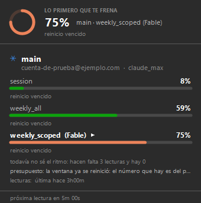

# H10 · Windows nativo y las vías de instalación, medido

H4 cerró la mitad que se podía cerrar: el CLI corre en Node nativo de Windows y
lee cuota sin credencial. Terminaba con una frase que era una deuda:

> `bin/qm` es un `/bin/sh` y no sirve del lado de Windows (…) Es la otra cosa
> que falta para que Windows nativo sea una plataforma de primera y no un
> experimento: un `qm.cmd`.

Esto es esa deuda pagada, más las vías por las que alguien puede instalar todo
esto sin clonar el repo. Y, sobre todo, es lo que apareció al **correrlo en un
Windows de verdad** en vez de razonar sobre él: **nueve cosas**, ocho invisibles
desde Linux y una anterior a este trabajo.

**Máquinas de medición.**

- Linux, diez cuentas de agentes: lo de los tiempos y los paquetes.
- **Windows 10 Pro 22H2 (build 19045), en español (México), PowerShell 5.1**,
  en una VM de KVM sobre esta misma máquina. Sin Git, sin Node, sin Claude Code:
  una instalación limpia, que es la que importa.

---

## Lo que apareció al correrlo en Windows

### 1. `chcp` a mitad de un `.cmd` desincroniza el parser de cmd.exe

`qm.cmd` cambia la codepage a UTF-8 —para arreglar el mojibake que H4 dejó
anotado— y la devuelve al salir. Con comentarios que tenían caracteres de caja
(`──`), la primera corrida en Windows dio esto:

```
"────────────────────────" no se reconoce como un comando interno o externo
```

cmd.exe lee el archivo **por offset de bytes** y lo decodifica con la codepage
vigente. Al cambiarla en medio, los offsets calculados con la anterior dejan de
corresponder: el parser cayó adentro de un comentario y ejecutó su cola.

El encabezado del archivo decía «ASCII puro a proposito» y el archivo **no era
ASCII**: los separadores de sección eran U+2500. La regla estaba escrita y no
estaba cumplida. Ahora los cinco `.cmd` son ASCII de verdad, comprobado byte a
byte, y el síntoma desapareció.

### 2. Un `rem` con `>` adentro **redirige igual**

```
rem   1. busca un Node >= 22.6 (…)
```

cmd resuelve las redirecciones antes de decidir que la línea es un comentario,
así que cada invocación creaba un archivo llamado `=` en el directorio actual.
Tres líneas así entre `qm.cmd` y `buscar-node.cmd`. Reescritas sin `>` ni `<`.

### 3. `npm run construir` nunca funcionó en Windows

Y esto **no lo trajo este trabajo**: estaba en `scripts/construir.mjs` desde H9.

```
Error: spawnSync C:\qm\node_modules\.bin\tsc ENOENT
```

`node_modules/.bin/tsc` sin extensión existe sólo en POSIX; en Windows npm deja
`tsc.cmd` y `tsc.ps1`. De ese build cuelgan el tarball de npm, el instalador y
el job de CI que lo compila — o sea que el instalador de Windows no se podía
armar en Windows. Ahora se ejecuta `node node_modules/typescript/bin/tsc`, que
es el mismo compilador del lockfile sin pasar por el shim ni por un `.cmd`.

Es la misma familia de defecto que H9: un camino que anda en POSIX y muere en
Windows, invisible mientras nadie lo corra ahí.

### 4. Un `.ps1` sin BOM no lo parsea PowerShell 5.1

El README ya lo decía de `bin/qm-tray.ps1` —«UTF-8 con BOM a propósito: sin
BOM, PowerShell 5.1 lo lee como Windows-1252»— y los dos `.ps1` nuevos
(`gate-windows.ps1`, `hacer-setup.ps1`) salieron sin BOM. En Windows ni
arrancaron: los acentos rompieron los terminadores de cadena y el archivo no
compiló. El `.iss` del instalador tenía el mismo problema para los acentos de
su interfaz. Los tres llevan BOM ahora.

Una regla documentada en el README no se aplica sola a los archivos nuevos.

### 5. `winget install OpenJS.NodeJS.LTS` pide elevación

El MSI de Node exige administrador: en una sesión sin elevar sale
`Error del instalador con el código de salida: 1602` (el usuario canceló el
UAC). Importa para el manifest de winget, que declara ese paquete como
dependencia: el instalador de quartermaster es por usuario y no pide UAC, pero
**su dependencia sí**. Está anotado en `paquetes/README.md`.

### 6. ISCC lee las etiquetas de sección ADENTRO de los comentarios

```
Error on line 125 in quartermaster.iss: Invalid section tag.
```

La línea 125 era un comentario del `[Code]` que explicaba por qué el PATH no se
toca con una entrada de la sección Registry — y tenía ese nombre entre
corchetes, al principio de la línea. ISCC busca las etiquetas de sección al
principio de cada renglón y no le importa estar adentro de un comentario.

### 7. Y los comentarios de llaves de Pascal Script no anidan

Arreglado lo anterior, la siguiente:

```
Error on line 125: Column 47: 'BEGIN' expected.
```

El mismo comentario mencionaba la constante `{olddata}`. La llave que la cierra
cerró el comentario, y el resto del párrafo se compiló como código. Las dos
lecciones quedaron escritas adentro de ese comentario, que es donde sirven.

### 8. Inno Setup sin administrador no queda donde lo buscaba mi script

`hacer-setup.ps1` buscaba `ISCC.exe` en `Archivos de programa`. Una instalación
`/CURRENTUSER` —la única que se puede hacer sin UAC, y la que se hizo en la VM—
lo deja en `%LOCALAPPDATA%\Programs\Inno Setup 6`. Esa ruta ahora está en la
lista de candidatos.

### 9. El aviso de «el ícono está escondido» no existe en Windows 10

`RevisarSiSeVe` lee `HKCU\Control Panel\NotifyIconSettings` para avisar cuando
Windows manda el ícono al desplegable. En esta máquina esa clave **no existe**:
es de Windows 11. En Windows 10 la función encuentra cero items y vuelve en
silencio — no rompe nada, pero la red de seguridad que describe el README está
sólo en 11. El ícono efectivamente salió escondido, y nadie avisó.

---

## El número que faltaba: qué hacía el shim viejo

Era la deuda explícita de la primera versión de esta página. El cambio de
`bin/qm` a `bin/qm.mjs` como entrada de npm se había hecho **razonando** sobre
cómo npm arma los shims. Ahora está medido, en esa VM sin Git:

**`sh` en el PATH: no hay.** (`Get-Command sh` → nada.)

Con `bin.qm = "bin/qm"` (el shebang `#!/bin/sh`), npm genera:

```bat
IF EXIST "%dp0%\/bin/sh.exe" (
  SET "_prog=%dp0%\/bin/sh.exe"
) ELSE (
  SET "_prog=/bin/sh"
  SET PATHEXT=%PATHEXT:;.JS;=;%
)
endLocal & goto #_undefined_# 2>NUL || title %COMSPEC% & "%_prog%" "%dp0%\node_modules\@legios\quartermaster\bin\qm" %*
```

Y al invocarlo:

```
> qm --breve
El sistema no puede encontrar la ruta especificada.
exit 1
```

`npm install -g` dice «added 1 package» y el comando no arranca, con un mensaje
que no nombra ni a `sh` ni a Node ni a quartermaster. Es **exactamente** el
defecto de H9 una capa más arriba: no en el tarball, en el shim.

### Y no depende de que falte Git, que es lo que yo suponía

La primera versión de esta página decía que el defecto aparecía «en un Windows
sin Git», porque esa era la máquina donde se midió. El runner de
`windows-latest` contestó la otra mitad en la primera corrida del gate:

```
· sh en el PATH de esta máquina: C:\Program Files\Git\bin\sh.exe
· con bin/qm (sh) el shim NO arranca: salió 1 — The system cannot find the path specified.
```

**Con `sh.exe` instalado y en el PATH, el shim falla igual.** Mirando el .cmd
que genera npm se ve por qué: no busca `sh` en el PATH, invoca `/bin/sh` —una
ruta POSIX absoluta— salvo que exista `%dp0%\/bin/sh.exe`, que no existe nunca.
O sea que no es «Windows sin Git»: es Windows.

Dos máquinas, dos configuraciones opuestas de `sh`, el mismo exit 1. El gate lo
sigue midiendo en vez de afirmarlo, que es de donde salió esta corrección.

Con `bin.qm = "bin/qm.mjs"`, en la misma máquina:

```
qm --breve
No se encontró ninguna cuenta de Claude Code ni de Codex en esta máquina.
exit 0
```

Que es la respuesta correcta para una máquina sin cuentas: una frase, no un
silencio (SOUL.md).

## Lo demás que se comprobó en esa VM

- **`bin\qm.cmd` corre desde el repo**, sin build, leyendo el TypeScript.
- **Los códigos de salida viajan**: 0 normal, 2 con una opción desconocida. Un
  lanzador que devuelve siempre 0 rompería `qm --umbral` en silencio.
- **`qm --json` es JSON válido** y dice `plataforma: win32`.
- **`npm run construir` compila** (después del arreglo 3).
- **El gate `scripts/gate-windows.ps1` da verde** de punta a punta: empaqueta,
  instala en un prefix limpio y ejecuta.

## El instalador, instalado y desinstalado de verdad

Compilado con ISCC 6.7.3 adentro de la VM:

| artefacto | tamaño |
|---|---|
| `quartermaster-0.1.5-setup.exe` | **2228,4 kB** |
| `quartermaster-0.1.5-win.zip` (el portable de scoop) | **198,5 kB** |

Instalado con `/VERYSILENT /SUPPRESSMSGBOXES /NORESTART`, que es como lo
invocaría winget:

- **exit 0 y sin UAC.** Quedó en `%LOCALAPPDATA%\Programs\quartermaster`, con
  los ocho archivos de `bin\`.
- **El PATH del usuario pasó de**
  `…\WindowsApps;` **a** `…\WindowsApps;…\Programs\quartermaster\bin`.
- Tres accesos directos: dos en el menú Inicio y `quartermaster.lnk` en la
  carpeta de arranque.
- **`qm --breve` corre escribiendo `qm` a secas**, con los acentos bien.
- **La bandeja arranca**: un proceso, y el ícono aparece en el área de
  notificación — adentro del desplegable de escondidos, que es exactamente lo
  que Windows hace con un ícono nuevo y lo que el README ya decía.

Y al desinstalar (`unins000.exe /VERYSILENT`):

| | antes | después |
|---|---|---|
| procesos de la bandeja | 1 | **0** |
| el directorio | existe | **borrado** |
| PATH del usuario | con nuestro `bin` | **como estaba** |
| accesos directos | 3 | **0** |

La bandeja se cierra sola porque el desinstalador corre `qm-tray-quitar.cmd`
antes de borrar nada: un `.ps1` que un proceso tiene abierto no se puede
borrar, y la desinstalación quedaría a medias con el ícono todavía arriba.

(Un detalle cosmético: el PATH original terminaba en `;` y vuelve sin él.)

## Y los dos gates, verdes en Windows

```
gate de Windows: verde - qm.cmd corre desde el repo, el paquete de npm instala
y arranca, y el código de salida viaja
gate de la bandeja: verde - parsea, dibuja 340 px en los dos temas, nada se sale
del margen, el panel de una cuenta no es el de todas, y resuelve qm nativo /
WSL / frase
```

## La bandeja contra una cuenta de verdad

Era el punto abierto de la primera versión de esta página. Se cerró poniéndole
a la VM un perfil con la forma y los números REALES: el archivo sale de
`test/fixtures/cached-usage-max.json`, que es una respuesta del endpoint
comiteada en el repo, con las fechas traídas a ahora.

`qm` en Windows, contra esa cuenta:

```
  .claude            cuenta-de-prueba@ejemplo.com   · claude_max
                     credencial: ilegible · Windows sin verificar: no hay
                     .credentials.json y puede que use DPAPI
                     cache · hace 3h01m
                     session                  █░░░░░░░░░░░░░░   8%
                     weekly_all               █████████░░░░░░  59%
                   ▸ weekly_scoped (Fable)    ███████████░░░░  75% warning

  lo primero que te frena: .claude · weekly_scoped (Fable) 75%
```

Que es **el hallazgo entero del proyecto, funcionando en Windows**: las dos
barras famosas dicen 8 % y 59 %, y la que frena —que no tiene clave con nombre
propio y vive adentro de `limits[]`— va al 75 % con aviso del servidor.
`--breve` contesta `main 8/75%!`.

Y la bandeja dibujando ese mismo JSON, en su modo de captura:



340x345 px, con el anillo de «lo primero que te frena» al 75 %, la cuenta con
su plan, y las tres barras.

### Y un mojibake que no era de la bandeja

La primera captura salió con los acentos rotos en dos renglones. Antes de
anotarlo como bug se comprobó de dónde venía: el JSON se había capturado con
`qm --json | Out-File`, y ahí PowerShell decodifica la salida de qm con la
codepage OEM antes de escribirla. Redirigiendo con `cmd` —que pasa los bytes
tal cual— el panel sale con los acentos bien.

O sea: era la captura, no el render. La bandeja levanta el proceso con
`StandardOutputEncoding = UTF8`, que es justo lo que evita esto.

De yapa, el mismo diagnóstico dejó una demostración del hallazgo 4: la línea que
se escribió para comprobar los acentos **no encontró nada**, porque el `.ps1`
que la contenía se generó sin BOM y PowerShell 5.1 lo leyó como Windows-1252.
El test se rompió por el mismo motivo que estaba buscando.

## Lo medido en Linux

### El despachador de npm no cuesta nada, y ahorra un proceso

Mediana de 7 corridas de `--breve`, con `dist/` presente:

| entrada | mediana |
|---|---|
| `node bin/qm.mjs` | **692 ms** |
| `bin/qm` (sh → node) | 927 ms |
| `node dist/cli/qm.js` (el piso) | 700 ms |

692 contra 700: el despachador está dentro del ruido del piso, no es una capa
que se pague. 692 contra 927: los ~235 ms son el `sh` y el segundo arranque de
Node que el camino de npm ya no hace.

### El zip de la extensión sale con la forma que pide el sitio

`make extension-zip` → **4366 bytes**, con `metadata.json`, `stylesheet.css` y
`extension.js` en la raíz, que es la regla que extensions.gnome.org aplica.

### Los dos nombres estaban libres

- **AUR**: la RPC devuelve `resultcount: 0` para `quartermaster`.
- **extensions.gnome.org**: buscar «quartermaster» devuelve *Quarter Windows* y
  nada más. Hoy la extensión sólo la tiene quien clonó el repo.

### Y la resolución de qm de la bandeja, corrida y no leída

Con un pwsh 7.6.6 bajado sólo para esto, sacando `ArgsWsl`, `ResolverQm` y
`PsiQm` por AST y corriéndolas contra un `bin/` de mentira **con un espacio en
la ruta**:

| escenario | modo | lo que sale |
|---|---|---|
| `qm.cmd` al lado | `nativo` | `/d /s /c ""/tmp/qm gate/bin/qm.cmd" --json --breve"` |
| `-QmLinux` explícito | `wsl` | `wsl.exe -e bash -lc "qm --json --breve"` |
| `-Qm` a una ruta que no existe | `ninguno` | frase, y `PsiQm` devuelve `$null` |
| ni `qm.cmd` ni `wsl.exe` | `ninguno` | frase |

---

## La primera release de verdad (0.1.6, 2026-09-13)

El tag `v0.1.6` disparó los trece jobs. Esto es lo que publicó **comprobado
desde afuera**, que es distinto de lo que dijo el resumen del workflow:

| canal | el workflow dijo | comprobado afuera |
|---|---|---|
| npm | success | `dist-tags.latest = 0.1.6`, con `attestations.provenance` (SLSA v1) |
| release de GitHub | success | cinco assets: `.deb` (128 460 B), `setup.exe` (2 266 020 B), `win.zip` (182 405 B), el zip de la extensión (5381 B) y `SHA256SUMS.txt` |
| brew | success | la fórmula del tap apunta al tarball de `v0.1.6` |
| apt | success | `dists/stable/Release` en `Version: 0.1.6`, `InRelease` firmado |
| scoop | publicado | `bucket/quartermaster.json` en `0.1.6` |
| winget | **failure**, y después success | ver abajo: primero el token, después el fork |
| AUR | success, pero NO publicó | correcto: el registro sigue cerrado |
| gnome | a mano | la 10949 sigue en `Unreviewed` |

Siete de ocho después del segundo intento de winget, y la que falta —el AUR—
por una razón conocida y ajena.

**winget, al segundo intento.** El token era el problema y nada más: con
`TOKEN_WINGET` regenerado (classic, `public_repo`) y un rerun de ese solo job,
`wingetcreate` forkeó y abrió
[el PR #434159](https://github.com/microsoft/winget-pkgs/pull/434159).
Comprobado consultando el PR, no leyendo el notice del workflow — que en ese
rerun seguía siendo el viejo, porque un rerun usa el workflow del tag y el
arreglo se commiteó después.

**Y al tercero, desde el fork que corresponde.** Ese PR salía de
`ValentinTorassa/winget-pkgs`: una cuenta personal. `wingetcreate submit`
forkea SIEMPRE al dueño del token y **no tiene opción para elegir otro dueño**
—`--prtitle`, `--replace`, `--token`, `--no-open`, y se acabó—, así que la
rama de una release de Legios no podía vivir en Legios usando esa herramienta.

Se rehizo por API: fork a `legiosai/winget-pkgs`, rama, los cuatro manifests,
PR. Antes de rehacerlo se comprobó que los manifests que emite
`scripts/hacer-manifests.mjs` y los que había normalizado `wingetcreate` son
**equivalentes** —cargados como YAML, mismas claves y mismos valores en los
cuatro archivos; difieren en el orden y en un comentario de cabecera—, así que
no se cambió nada de contenido al mover el PR. Los dos SHA256 del instalador y
del zip se recalcularon bajando los assets de la release y se compararon con el
`SHA256SUMS.txt` publicado: iguales.

Resultado: [#434160](https://github.com/microsoft/winget-pkgs/pull/434160),
con la cabeza en `legiosai:Legios.Quartermaster-0.1.6`, y el #434159 cerrado
para no dejarle dos PR abiertos por el mismo paquete a un repo ajeno.

Lo que **no** se puede mover: el autor del PR. En GitHub un PR lo abre una
cuenta de usuario, nunca una organización — el fork y la rama viven en la org,
la firma es de la persona. El CLA también.

Para que la próxima release no vuelva a la cuenta personal, el job dejó de usar
`wingetcreate` y usa `scripts/mandar-pr-winget.mjs`, con
`make gate-winget-rojo` comprobando que los tres caminos que no mandan nada
—sin token, sin versión, con un token muerto— salgan en rojo.

### Lo que rompió, que es lo que vale anotar

**`$ErrorActionPreference = 'Stop'` no alcanza para un `.exe`.** `wingetcreate`
contestó `Token was invalid`, salió 1 y no mandó nada — y la línea siguiente
del script igual imprimió `::notice::winget: PR mandado para 0.1.6`. El job
terminó en rojo igual, porque pwsh propaga el último exit code al salir del
step, así que el resumen dijo `failure` y no mintió. El que mintió fue el
notice, que es justo lo que alguien abre para saber si hay PR o no.

En PowerShell, `$ErrorActionPreference` gobierna los cmdlets; un comando nativo
que sale distinto de cero no levanta excepción. Arreglado con un
`if ($LASTEXITCODE -ne 0)` explícito, que además dice qué mirar y que los
manifests quedaron armados para mandarlos a mano.

**Y el token viajaba por la línea de comandos.** La propia herramienta lo avisa
en el log: *"Using the --token argument may result in the token being logged"*.
Ahora va por `WINGET_CREATE_GITHUB_TOKEN`, que es lo que
[winget-create documenta para CI](https://github.com/microsoft/winget-create).

Las dos son la misma clase de bug que el resto del archivo: el canal no publicó
y había una línea diciendo que sí.

---

## Lo que sigue sin medirse

- ~~**La credencial de Windows, que es lo de H4.**~~ **Cerrada el 2026-09-13**,
  y no con la VM: leyendo el binario que Claude Code instala, como el endpoint
  de H2. No usa DPAPI — es el mismo `.credentials.json`. Está en
  [`h4-windows.md`](h4-windows.md), con lo que la desmentiría.
- ~~**`winget validate` y el PR a winget-pkgs.**~~ **Medio cerrada el
  2026-09-13** por la release de 0.1.6: `winget validate` corrió sobre los
  cuatro manifests generados y dijo `Manifest validation succeeded` (con un
  aviso de que no puede validar la dependencia `OpenJS.NodeJS.LTS`, que es
  esperable: valida forma, no catálogo), y el PR salió: el #434160. Del CI de
  `microsoft/winget-pkgs` ya contestaron seis checks en verde —Pull Request
  Validation, Manifest Validation, URLs Validation, URL Domain Validation,
  Manifest Policy Validation y Catalog Content Verification—; los otros cuatro
  y el revisor esperan al CLA, que lo firma una persona. Eso no depende de
  nosotros y no tiene fecha.
- **`scripts/mandar-pr-winget.mjs` corriendo EN CI, con `TOKEN_WINGET`.** El
  camino completo —forkear a la org, ramificar, abrir el PR— se ejecutó a mano
  desde esta máquina y con otro token; lo que corrió con `TOKEN_WINGET` fue la
  versión vieja, la de `wingetcreate`. En CI, del script nuevo, sólo está
  probado que falle: `make gate-winget-rojo`. Lo que no se sabe es si un PAT
  classic con `public_repo` alcanza para escribir en un repo de la
  organización desde un runner — el script lo comprueba antes de tocar nada de
  Microsoft y falla con el link a la pantalla de la org, pero eso también está
  sin ejecutar. Se sabrá en el próximo tag.

La diferencia entre esta sección y el resto del archivo es la de siempre:
arriba están los números, acá están las preguntas, y ninguna de las dos se
disfraza de la otra.
